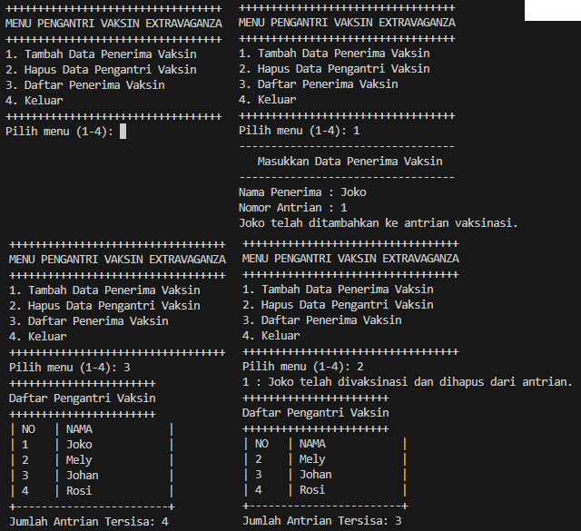
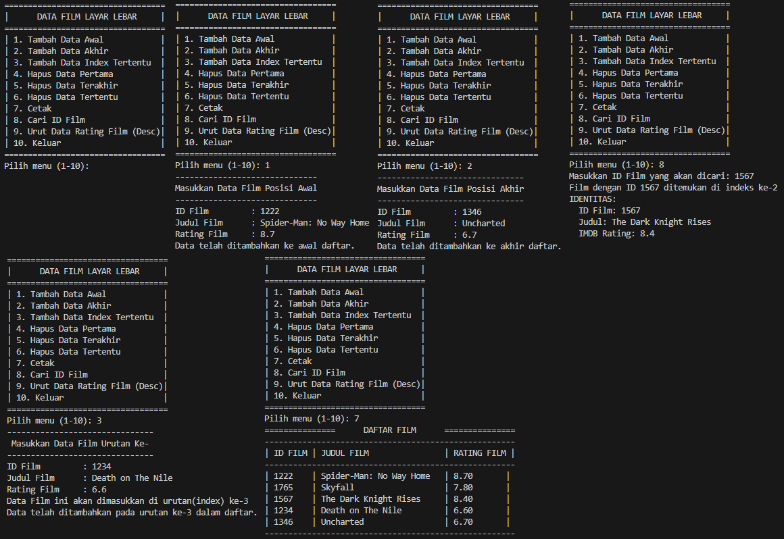

# LAPORAN JOBSHEET 10 DOUBLY LINKED LIST
**NAMA  : ANANDA ABIMANYU SAPUTRA**

**NIM   : 2241760093**

**KELAS : SIB 2C**

## 10.2 Praktikum 1
### Pertanyaan
1. Jelaskan perbedaan antara single linked list dengan doubly linked lists!
2. Perhatikan class Node, di dalamnya terdapat atribut **next** dan **prev**. Untuk apakah atribut tersebut?
3. Perhatikan konstruktor pada class **DoublyLinkedList**. Apa kegunaan inisialisasi atribut **head** dan **size**?
4. Pada method **addFirst()**, mengapa dalam pembuatan objek dari konstruktor class Node prev dianggap sama dengan null?

        head = new Node(null, data, null);
5. Perhatikan pada method **addFirst()**. Apakah arti statement **head.prev = newNode**?
6. Perhatikan isi method **addLast()**, apa arti dari pembuatan objek Node dengan mengisikan parameter **prev** dengan **current**, dan **next** dengan **null**?

        Node newNode = new Node(current, data, null);
7. Pada method **add()**, terdapat potongan kode program sebagai berikut,
 
        if (current.prev == null) {
            Node newNode = new Node(null, data, current);
            current.prev = newNode;
            head = newNode;
        }

### Jawaban
1. Perbedaan utama antara keduanya terletak pada cara node-node terhubung satu sama lain:
    * Single Linked List:
        * Setiap node hanya memiliki satu referensi atau tautan ke node berikutnya dalam daftar.
        * Hanya dapat mengakses elemen berikutnya dari node saat ini, tidak dapat mundur ke elemen sebelumnya tanpa mengiterasi dari awal.
        * Implementasi lebih sederhana dan membutuhkan sedikit ruang memori karena hanya ada satu tautan per node.
    * Doubly Linked List:
        * Setiap node memiliki dua referensi atau tautan, satu ke node sebelumnya (prev) dan satu ke node berikutnya (next) dalam daftar.
        * Dapat mengakses elemen sebelumnya (mundur) dan elemen berikutnya dari node saat ini, karena masing-masing node memiliki dua tautan.
        * Implementasi lebih kompleks dan membutuhkan sedikit lebih banyak ruang memori karena setiap node harus menyimpan dua tautan tambahan.
2. Kedua atribut digunakan untuk menghubungkan node-node dalam doubly linked list.
    * **next**: Referensi ke node berikutnya dalam daftar. Dengan atribut ini, dapat melanjutkan ke node selanjutnya dari node saat ini saat ingin bergerak maju dalam daftar.
    * **prev**: Referensi ke node sebelumnya dalam daftar. Ini memungkinkan untuk melanjutkan ke node sebelumnya dari node saat ini. Atribut prev memungkinkan navigasi mundur dalam daftar.
3. * Inisialisasi **head**: **head** adalah referensi ke node pertama dalam doubly linked list. Dalam konstruktor, **head** diatur ke **null**, yang menunjukkan bahwa daftar saat ini kosong. Ketika membuat sebuah instansiasi dari DoublyLinkedList, harus dipastikan bahwa daftar awalnya tidak memiliki elemen, sehingga **head** diatur ke **null**.
    * Inisialisasi **size**: **size** adalah variabel yang digunakan untuk melacak jumlah elemen dalam daftar. Dalam konstruktor, **size** diatur ke 0, karena ketika daftar baru dibuat, belum ada elemen di dalamnya. Seiring dengan penambahan dan penghapusan elemen, **size** akan diperbarui.
4. **prev** = null, karena kita sedang menambahkan elemen baru ke awal (head) dari Doubly Linked List.

    Pada Doubly Linked List, setiap elemen memiliki dua pointer, yaitu **next** yang mengarah ke elemen berikutnya, dan **prev** yang mengarah ke elemen sebelumnya. Ketika kita menambahkan elemen di awal, elemen yang baru ditambahkan akan menjadi elemen pertama atau elemen "head". Karena elemen ini menjadi elemen pertama, maka tidak ada elemen sebelumnya (elemen sebelumnya adalah null), itulah mengapa prev diatur menjadi null.
5. Statement **head.prev = newNode** berarti mengatur referensi **prev** dari elemen yang saat ini menjadi elemen pertama (yaitu head) untuk menunjuk ke elemen yang baru (yaitu newNode).
6. * **prev** yang diisikan dengan **current**: Ini menghubungkan elemen yang baru dibuat (**newNode**) dengan elemen yang sedang menjadi elemen terakhir (**current**). Dengan kata lain, **newNode** menjadi elemen berikutnya (**next**) dari elemen **current**, dan elemen **current** menjadi elemen sebelumnya (**prev**) dari **newNode**.

    * **next** yang diisikan dengan **null**: Karena elemen yang baru ditambahkan adalah elemen terakhir dalam Doubly Linked List, maka tidak ada elemen sesudahnya (berikutnya). Oleh karena itu, **next** diatur menjadi **null** untuk menunjukkan bahwa ini adalah elemen terakhir dalam list.
7. Terdapat tiga tindakan yang dilakukan ketika kondisi **if (current.prev == null)** terpenuhi:
    * **Node newNode = new Node(null, data, current);** - Ini menciptakan sebuah objek Node baru dengan tiga parameter:
        * **null** untuk **prev**, yang menunjukkan bahwa elemen baru akan menjadi elemen pertama dalam daftar.
        * **data** adalah nilai data yang akan disimpan dalam elemen baru.
        * **current** adalah elemen yang sebelumnya menjadi elemen pertama dalam daftar dan akan menjadi elemen kedua setelah penambahan elemen baru ini.
    * **current.prev = newNode;** - Ini mengatur referensi **prev** dari elemen yang sebelumnya menjadi elemen pertama (yaitu **current**) untuk menunjuk ke elemen baru yang sekarang menjadi elemen pertama. Dengan kata lain, elemen yang sebelumnya menjadi elemen pertama dalam daftar sekarang memiliki prev yang menunjuk ke elemen baru.
    * **head = newNode;** - Ini mengatur **head** (elemen pertama dalam daftar) untuk menunjuk ke elemen baru. Ini diperlukan karena elemen baru sekarang menjadi elemen pertama dalam daftar setelah penambahan. Sehingga, head harus diperbarui untuk menunjuk ke elemen baru.

## 10.3 Praktikum 2
### Pertanyaan
1. Apakah maksud statement berikut pada method **removeFirst()**?
        
        head = head.next;
        head.prev = null;
2. Bagaimana cara mendeteksi posisi data ada pada bagian akhir pada method **removeLast()**?
3. Jelaskan alasan mengapa potongan kode program di bawah ini tidak cocok untuk perintah remove!

        Node tmp = head.next;
        head.next = tmp.next;
        tmp.next.prev = head;
4. Jelaskan fungsi kode program berikut ini pada fungsi remove!

        current.prev.next = current.next;
        current.next.prev = current.prev;

## Jawaban
1. * **head = head.next;**: Pernyataan ini mengubah referensi **head** untuk menunjuk ke elemen berikutnya (berikut elemen pertama) dalam linked list. Dengan kata lain, itu menggeser elemen pertama yang sekarang menjadi elemen kedua menjadi elemen pertama baru. Ini efektif menghapus elemen pertama dari linked list.
    * **head.prev = null;**: Setelah menggeser **head** ke elemen berikutnya, elemen pertama yang sekarang menjadi elemen kedua tidak lagi menjadi elemen pertama. Karena elemen pertama tidak memiliki elemen sebelumnya, referensi **prev** dari elemen pertama diatur ke **null**. Ini memutuskan hubungan antara elemen pertama yang sekarang dan elemen sebelumnya.
2. Langkah-langkah yang dilakukan untuk mendeteksi bahwa data ada pada bagian akhir dalam method removeLast():
    * Memeriksa apakah linked list masih kosong dengan memeriksa apakah **isEmpty()** (apakah **head** adalah **null**). Jika ya, maka linked list kosong, dan tidak ada elemen yang dapat dihapus.
    * Jika linked list tidak kosong, maka perlu menemukan elemen terakhir (elemen yang akan dihapus) dengan mengiterasi melalui linked list dari elemen pertama hingga elemen terakhir menggunakan perulangan **while**.
    * Pada saat **current.next** adalah **null**, menandakan bahwa **current** adalah elemen terakhir dalam linked list. Oleh karena itu, dapat melanjutkan dengan menghapus elemen ini.
3. * Kode ini hanya memeriksa elemen kedua (**tmp = head.next**) dan menghapus elemen tersebut. Ini hanya berfungsi untuk menghapus elemen kedua, bukan elemen lain di dalam linked list. Oleh karena itu, ini sangat terbatas dalam penggunaannya.
    * Kode ini tidak mempertimbangkan elemen terakhir dalam linked list. Jika mencoba menghapus elemen terakhir dengan kode ini, akan ada masalah karena tidak ada elemen setelahnya untuk memperbarui **next**.
    * Ketika menghapus elemen di tengah linked list, perlu memperbarui elemen yang sebelumnya adalah elemen tersebut. Kode yang diberikan tidak mencakup pernyataan untuk memperbarui elemen sebelumnya.
    * Kode ini juga tidak memeriksa apakah elemen yang ingin dihapus adalah elemen pertama dalam linked list, sehingga bisa menyebabkan masalah dalam kasus itu.
4. * **current.prev.next = current.next;**: Bagian ini berfungsi untuk mengatur referensi **next** dari node yang berada sebelum **current** (elemen sebelumnya) untuk menunjuk ke node setelah **current**. Dengan kata lain, elemen yang berada sebelum **current** akan "melewati" elemen **current** dan langsung menunjuk ke elemen setelah **current**. Ini menghilangkan **current** dari urutan linked list.
* **current.next.prev = current.prev;**: Bagian ini berfungsi untuk mengatur referensi **prev** dari node yang berada setelah **current** (elemen berikutnya) untuk menunjuk ke node yang berada sebelum **current**. Dengan kata lain, elemen yang berada setelah **current** akan "melewati" elemen **current** dan langsung menunjuk ke elemen yang berada sebelum **current**. Ini juga menghilangkan **current** dari urutan linked list.

## 10.4 Praktikum 3
### Pertanyaan
1. Jelaskan method **size()** pada class **DoublyLinkedList**!
2. Jelaskan cara mengatur indeks pada doubly linked lists supaya dapat dimulai dari indeks ke-1!
3. Jelaskan perbedaan karakteristik fungsi **Add** pada doubly linked list dan single linked list!
4. Jelaskan perbedaan logika dari kedua kode program di bawah ini!
    * Kode 1
    
            public boolean isEmpty() {
                if(size==0) {
                    return true;
                } else {
                    return false;
                }
            }
    * Kode 2

            public boolean isEmpty() {
                return head == null;
            }

### Jawaban
1. Method **size()** digunakan untuk mengembalikan jumlah elemen (ukuran) dalam Doubly Linked List. Cara kerjanya adalah dengan menghitung jumlah elemen dalam linked list dengan mengiterasi melalui elemen-elemen dari elemen pertama hingga elemen terakhir dan menghitung setiap elemen yang dijumpai. Jumlah ini kemudian dikembalikan sebagai hasil dari method size(). Dengan kata lain, method size() mengukur seberapa besar linked list tersebut.
2. Indeks pada struktur data seperti linked lists umumnya dimulai dari indeks ke-0, yang berarti elemen pertama memiliki indeks 0. Namun, jika ingin mengatur indeks untuk dimulai dari indeks ke-1, dapat menggunakan variabel atau penunjuk tambahan dengan mengatur elemen pertama sebagai elemen dengan indeks 1 dan kemudian terus meningkatkan indeks sesuai urutan elemen. Ini hanya merupakan masalah penamaan dan tata letak indeks dalam kode.
3. * Doubly Linked List: Setiap elemen memiliki dua pointer, yaitu **prev** yang mengarah ke elemen sebelumnya dan **next** yang mengarah ke elemen berikutnya. Ini memungkinkan navigasi lebih cepat ke elemen sebelumnya dan setelahnya. Ketika menambahkan elemen di tengah atau di akhir list, dapat mengakses elemen sebelumnya dan elemen berikutnya dengan mudah. Namun, ini membutuhkan lebih banyak ruang dalam memori untuk menyimpan pointer tambahan.
    * Single Linked List: Setiap elemen hanya memiliki pointer **next**, yang mengarah ke elemen berikutnya. Ini memungkinkan navigasi lebih lambat jika ingin mengakses elemen sebelumnya, karena harus melintasi seluruh list dari awal untuk mencapai elemen yang diinginkan. Namun, penggunaan memori lebih efisien karena hanya ada satu pointer untuk setiap elemen.
4. * Kode 1: Menggunakan pendekatan yang lebih eksplisit. Ini secara khusus memeriksa apakah variabel **size** sama dengan 0. Jika **size** adalah 0, maka metodenya akan mengembalikan **true**, yang menunjukkan bahwa linked list kosong. Jika **size** tidak sama dengan 0, metodenya akan mengembalikan **false**, yang menunjukkan bahwa linked list tidak kosong.
    * Kode 2: Pendekatan yang lebih langsung dan efisien. Ini hanya memeriksa apakah pointer **head** pada linked list adalah **null**. Jika **head** adalah **null**, maka linked list kosong, dan metodenya langsung mengembalikan **true**. Jika head tidak **null**, maka linked list tidak kosong, dan metodenya mengembalikan **false**   . Kode ini lebih singkat dan langsung menggambarkan apakah linked list kosong berdasarkan keberadaan atau ketiadaan elemen pertama (**head**).

## Tugas Praktikum
### Jawaban
1. 
2. 
