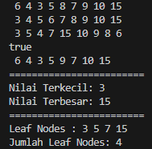
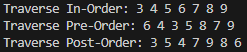

# LAPORAN JOBSHEET 11 `TREE`
**NAMA  : `ANANDA ABIMANYU SAPUTRA`**

**NIM   : `2241760093`**

**KELAS : `SIB 2C`**

## 11.2 Praktikum 1
### Pertanyaan
1. Mengapa dalam binary search tree proses pencarian data bisa lebih efektif dilakukan dibanding binary tree biasa?
2. Apa fungsi atribut **left** dan **right** pada class **Node**?
3. Simak pertanyaan berikut,
        
    1. Apa kegunaan dari atribut root di dalam class BinaryTree?
    2. Ketika objek tree pertama kali dibuat, apa nilai dari root?
4. Ketika tree masih kosong, dan akan ditambahkan sebuah node baru, proses apa yang akan terjadi?
5. Perhatikan method `add()`, di dalamnya terdapat baris program seperti di bawah ini. Jelaskan secara detil untuk apa baris program tersebut?

        if(data < current.data) {
            if(current.left != null) {
                current = current.left;
            } else {
                current.left = new Node(data);
                break;
            }
        }

### Jawaban
1. Binary search tree (BST) lebih efektif dalam pencarian data dibandingkan dengan binary tree biasa karena memiliki urutan total yang ketat. Pencarian sebuah nilai tertentu pada BST adalah sebuah proses yang dapat dilakukan secara rekursif karena nilai-nilai yang disimpan adalah terurut, yang memungkinkan pencarian dengan mengurangi jumlah simpul yang harus diperiksa. Dalam BST yang seimbang, waktu pencarian rata-rata yang jauh lebih cepat daripada dalam binary tree biasa.
2. Atribut left dan right pada class Node dalam struktur data Binary Search Tree (BST) digunakan untuk menghubungkan node dengan left child dan right child dari simpul tersebut. Ini adalah bagian integral dari representasi pohon biner dalam BST.

    * Atribut left (kiri) adalah referensi ke left child dari node tersebut. Left child memiliki nilai yang lebih kecil daripada nilai simpul tersebut berdasarkan sifat urutan BST.
    * Atribut right (kanan) adalah referensi ke right child dari node tersebut. Right child memiliki nilai yang lebih besar daripada nilai simpul tersebut berdasarkan sifat urutan BST.
3. * Atribut `root` dalam class `BinaryTree` digunakan untuk menunjukkan akar (root) dari pohon biner. Ini adalah titik awal yang digunakan untuk mengakses seluruh pohon dan menjalankan operasi pada pohon. Atribut `root` adalah pintu masuk utama ke dalam pohon biner.
    * Ketika objek pohon biner (instance dari class BinaryTree) pertama kali dibuat, nilai atribut root adalah null. Ini menandakan bahwa pohon saat itu kosong, karena belum ada simpul yang ditambahkan ke dalamnya.
4. Ketika tree masih kosong dan akan menambahkan sebuah node baru, proses yang akan terjadi sebagai berikut:

    1. Memanggil metode `add` pada objek binary tree (instance dari class BinaryTree) dengan nilai data yang ingin ditambahkan.
    2. Karena tree awalnya kosong (atribut root adalah null), metode `add` akan membuat node baru dengan nilai data tersebut.
    3. Node baru tersebut akan menjadi akar (root) dari pohon, sehingga atribut `root` akan diatur untuk merujuk ke node baru ini.
    4. Node tersebut sekarang adalah satu-satunya simpul (Node) dalam pohon.
5. Baris program ini bertanggung jawab untuk menentukan apakah node baru harus ditempatkan di sebelah kiri node saat ini (jika nilainya lebih kecil) atau apakah harus mencari lebih dalam ke anak kiri pohon (jika anak kiri sudah ada). Jika tidak ada anak kiri, node baru akan ditambahkan sebagai anak kiri simpul saat ini. Berikut detailnya: 
    1. `if(data < current.data)`: Ini adalah pengujian kondisi yang membandingkan nilai `data` yang ingin ditambahkan dengan nilai data dari simpul saat ini (`current`). Tujuannya adalah untuk menentukan apakah node baru harus ditempatkan di sebelah kiri simpul saat ini atau apakah harus mencari lebih dalam ke anak kiri.
    2. Di dalam blok `if(data < current.data)`, kita melakukan pengujian tambahan:
        * `if(current.left != null)`: Ini memeriksa apakah simpul saat ini memiliki anak kiri. Jika ya, itu berarti masih ada lebih banyak anak kiri yang perlu diperiksa, sehingga kita perlu memperbarui `current` untuk menjadikannya anak kiri dan melanjutkan pencarian ke anak kiri ini.
        * Jika `current.left` adalah `null`, artinya tidak ada anak kiri, maka kita menemukan lokasi yang tepat untuk menambahkan node baru dengan nilai `data`. Oleh karena itu, kita membuat node baru dengan nilai `data` dan mengatur anak kiri dari `current` ke node baru ini (`current.left = new Node(data)`). Kemudian, kita keluar dari loop pencarian dengan menggunakan `break`.

## 11.3 Praktikum 2
### Pertanyaan
1. Apakah kegunaan dari atribut `data` dan `idxLast` yang ada di class `BinaryTreeArray`?
2. Apakah kegunaan dari method `populateData()`?
3. Apakah kegunaan dari method `traverseInOrder()`?
4. Jika suatu node binary tree disimpan dalam `array indeks 2`, maka di indeks berapakah posisi `left child` dan `rigth child` masing-masing?
5. Apa kegunaan statement `int idxLast = 6` pada praktikum 2 percobaan nomor 4?

## Jawaban
1. * **Atribut data**: Atribut ini adalah array integer yang digunakan untuk menyimpan elemen-elemen pohon biner dalam bentuk array. Setiap elemen array ini mewakili nilai dari simpul dalam pohon biner. Dengan menggunakan array, pohon biner dapat direpresentasikan secara efisien dalam bentuk struktur `data` yang berurutan. Atribut `data` menyimpan semua elemen pohon dan memungkinkan akses cepat ke elemen-elemen tersebut.
    * **Atribut idxLast**: Atribut ini adalah indeks yang menunjukkan elemen terakhir dalam array `data`. Ini penting untuk menentukan batas elemen yang valid dalam pohon biner array. Dengan kata lain, `idxLast` menunjukkan indeks terakhir yang berisi `data` yang relevan dalam array `data`. Ketika Anda melakukan operasi seperti penelusuran, atribut ini memastikan bahwa hanya elemen-elemen yang valid dalam pohon yang diproses, sementara elemen lain yang tidak digunakan diabaikan.
2.  * **Inisialisasi Pohon**: Method `populateData()` memungkinkan untuk memasukkan data ke dalam pohon biner array, sehingga pohon memiliki elemen yang sesuai. Ini adalah langkah awal yang penting untuk memulai penggunaan pohon biner array.
    * **Mengatur idxLast**: Selain mengisi data, method ini juga mengatur atribut idxLast untuk menunjukkan indeks terakhir yang berisi data yang relevan dalam array data. Saat melakukan operasi pada pohon, dipastikan bahwa hanya elemen-elemen yang valid dalam pohon yang diproses, dan atribut idxLast membantu dalam hal ini.
    * **Memungkinkan Penggunaan Data Pohon yang Berbeda**: Dengan method `populateData()`, dapat dengan mudah mengubah data yang ada dalam pohon biner array, sehingga dapat menggunakan pohon ini untuk berbagai tujuan tanpa harus membuat objek pohon baru setiap kali.
3. * **Penelusuran In-Order**: Method `traverseInOrder()` melakukan penelusuran dalam-pesanan (in-order) pada pohon biner array. Dalam penelusuran in-order, elemen-elemen dicetak dalam urutan yang sesuai dengan aturan berikut: cetak elemen kiri, kemudian cetak elemen saat ini, lalu cetak elemen kanan.
    * **Pencetakan Data**: Method ini mencetak nilai dari setiap elemen dalam pohon biner array sesuai dengan urutan in-order. Dengan demikian, data dapat dilihat dalam urutan yang sesuai dengan struktur pohon biner, yang sering digunakan untuk tujuan analisis dan pemrosesan data.
    * **Rekursi**: Method `traverseInOrder()` menggunakan rekursi untuk melakukan penelusuran. Itu berarti method ini akan secara rekursif memanggil dirinya sendiri untuk menelusuri anak kiri, kemudian mencetak elemen saat ini, dan akhirnya menelusuri anak kanan. Ini adalah cara algoritma in-order bekerja dalam pohon biner.
4. Jika suatu node disimpan dalam array[indeks], maka:
    * Posisi `left child` akan berada di `array[2 * indeks + 1]`.
    * Posisi `right child` akan berada di `array[2 * indeks + 2]`.

    Jadi, jika node disimpan dalam `array[2]`, maka `left child` akan berada di `array[2 * 2 + 1]`, yaitu **`array[5]`**, dan `right child` akan berada di `array[2 * 2 + 2]`, yaitu **`array[6]`**.
5. Pernyataan `int idxLast = 6` dalam kelas `BinaryTreeArrayMain` digunakan untuk menginisialisasi variabel `idxLast`. Variabel ini mengindikasikan indeks terakhir yang berisi data yang relevan dalam pohon biner array yang akan digunakan. Dengan mengatur `idxLast` ke nilai 6, user dapat menentukan bahwa pohon memiliki elemen-elemen yang relevan dalam indeks 0 hingga 6 dalam array data.

## Tugas Praktikum
### Jawaban
* **OUTPUT NO 1, 2, 3, 4**

    

* **OUTPUT NO 5**
    
    