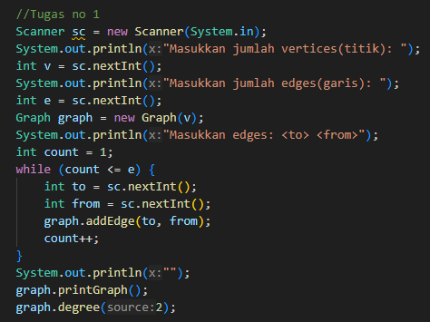
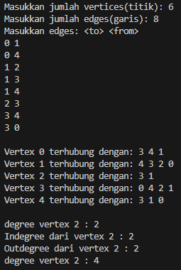
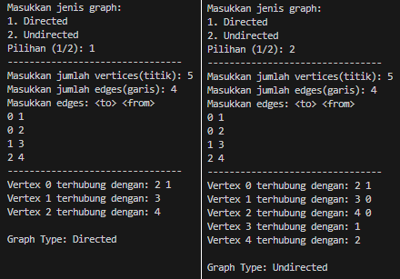
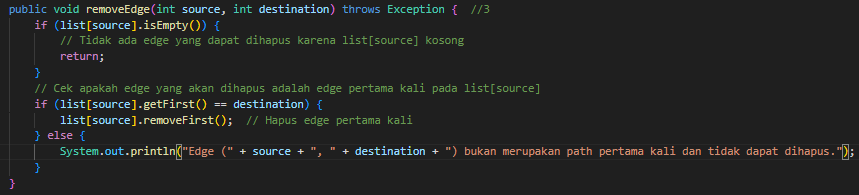
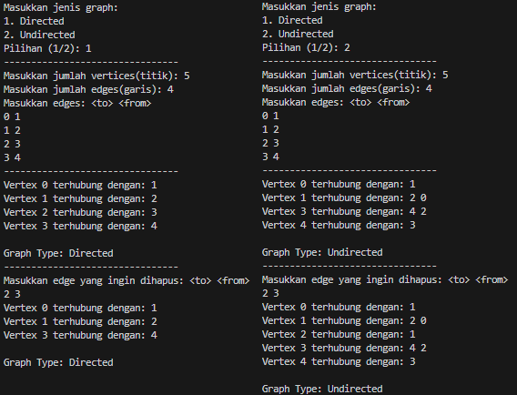

# LAPORAN JOBSHEET 12 `GRAPH`
**NAMA  : `ANANDA ABIMANYU SAPUTRA`**

**NIM   : `2241760093`**

**KELAS : `SIB 2C`**

## 12.2 Praktikum 1
### Pertanyaan
1. Sebutkan beberapa jenis (minimal 3) algoritma yang menggunakan dasar Graph, dan apakah **kegunaan** algoritma-algoritma tersebut?
2. Pada class Graph terdapat array bertipe LinkedList, yaitu LinkedList list[]. Apakah tujuan pembuatan variabel tersebut ? 
3. Apakah alasan pemanggilan method `addFirst()` untuk menambahkan data, bukan method add jenis lain pada linked list ketika digunakan pada method `addEdge` pada `class Graph`?
4. Bagaimana cara mendeteksi prev pointer pada saat akan melakukan penghapusan suatu edge pada graph ?
5. Kenapa pada praktikum 12.2 langkah ke-12 untuk menghapus path yang bukan merupakan lintasan pertama kali menghasilkan output yang salah ? Bagaimana solusinya ?

        graph.removeEdge(1, 2);
        graph.printGraph();

### Jawaban
1. * **Breadth-First Search (BFS):**
        * **Kegunaan:** BFS digunakan untuk menjelajah atau mencari informasi di dalam graf secara berlapis. Algoritma ini dapat digunakan untuk mencari jalur terpendek antara dua simpul (node) atau untuk menjelajahi semua simpul dalam graf.

    * **Dijkstra's Algorithm:**
        * **Kegunaan:** Dijkstra's Algorithm digunakan untuk menemukan jalur terpendek dari satu simpul ke semua simpul lainnya dalam graf berbobot positif. Algoritma ini umumnya digunakan dalam masalah jaringan, seperti perencanaan rute pada jaringan komunikasi atau transportasi.

    * **Kruskal's Algorithm:**
        * **Kegunaan:** Kruskal's Algorithm digunakan untuk menemukan Minimum Spanning Tree (pohon rentangan minimum) dalam graf berbobot. Minimum Spanning Tree adalah subgraf yang terhubung dan mengandung semua simpul graf asli tanpa membentuk siklus, dengan total bobot minimum.

    * **Bellman-Ford Algorithm:**
        * **Kegunaan:** Bellman-Ford Algorithm digunakan untuk menemukan jalur terpendek dari satu simpul ke semua simpul lainnya dalam graf dengan bobot yang mungkin negatif. Algoritma ini berguna dalam mengatasi masalah routing di jaringan komunikasi yang dapat memiliki bobot negatif.
2. Variabel `LinkedList list[]` pada class `Graph` digunakan untuk menyimpan representasi struktur data adjacency list. Ini memungkinkan kita merepresentasikan bagaimana setiap simpul terhubung dengan simpul-simpul lainnya dalam graf.
3. Karena memudahkan untuk menambahkan simpul baru ke awal daftar tetangga dalam representasi adjacency list. Ini lebih sederhana dan efisien karena kompleksitas waktu operasi `addFirst()` yang artinya dilakukan dengan cepat dan tidak tergantung pada jumlah elemen yang sudah ada.
4. 
5. 

## 12.3 Praktikum 2
### Pertanyaan
1. Apakah perbedaan degree/derajat pada *directed* dan *undirected graph*?
2. Pada implementasi graph menggunakan adjacency matriks. Kenapa jumlah vertices harus ditambahkan dengan 1 pada indeks array berikut?
        
        public GraphArray(int v){
            vertices = v;
            twoD_array = new int[vertices+1][vertices+1];
        }
3. Apakah **kegunaan** method `getEdge()` ?
4. Termasuk jenis graph apakah uji coba pada praktikum 12.3 ?
5. Mengapa pada method main harus menggunakan `try-catch Exception`?

## Jawaban
1. * Degree pada **Directed Graph:**
    
        Pada graf berarah, in-degree dan out-degree dapat berbeda untuk setiap simpul, dan total degree tetap merupakan jumlah keseluruhan tepi yang terhubung ke simpul tersebut.
    * Degree pada **Undirected Graph:**
    
        Pada graf tidak berarah, degree in dan degree out akan sama untuk setiap simpul, dan total degree dapat dihitung dengan menggabungkan keduanya.
2. Penambahan satu pada jumlah vertices pada array indeks dimulai dari 1 pada implementasi adjacency matrix mungkin dilakukan untuk menyederhanakan indeks dan membuatnya lebih intuitif, terutama jika kita ingin memetakan langsung antara simpul-simpul graf dengan indeks array.

    Misalnya, jika kita ingin merepresentasikan simpul-simpul graf dari 1 hingga N, dan kita ingin menggunakan array dengan indeks dimulai dari 1, maka kita dapat mengalokasikan array dengan ukuran `[vertices+1][vertices+1]`. Dengan cara ini, kita dapat langsung menggunakan indeks array untuk merepresentasikan simpul-simpul, tanpa perlu melakukan penyesuaian atau penggeseran indeks.
3. Method `getEdge(int to, int from)` pada implementasi graf menggunakan adjacency matrix digunakan **untuk** mendapatkan informasi tentang keberadaan tepi (edge) antara dua simpul tertentu. **Fungsinya** adalah untuk mengembalikan bobot atau nilai yang merepresentasikan keberadaan hubungan antara simpul `to` dan simpul `from`.
4. Graph berarah yang tidak berbobot.
5. Pemakaian try-catch berguna untuk menangani kemungkinan exception atau kesalahan yang dapat terjadi selama eksekusi program. Dengan menggunakan try-catch, dapat memberikan penanganan yang tepat terhadap exception tersebut dan mencegah program berhenti secara mendadak jika terjadi kesalahan.

## Tugas Praktikum
### Jawaban
1. * Modifikasi Program:

        
    
    * Output:
    
        
2. * Output:
    
        
3. * Modifikasi Program:

        
    
    * Output:
    
        
4. 