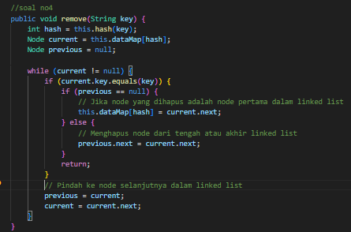
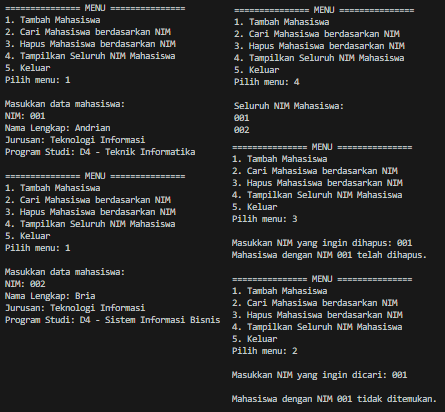

# LAPORAN JOBSHEET 14 `HASH TABLE`
**NAMA  : `ANANDA ABIMANYU SAPUTRA`**

**NIM   : `2241760093`**

**KELAS : `SIB 2C`**

## 14.2 Praktikum 1
### Pertanyaan
1. Apa keunggulan penanganan collision menggunakan metode separate chaining dibandingkan dengan motode linear probing?
2. Apa maksud dari potongan kode berikut pada method `hash()`?

        int hash = 0;
        for (int i = 0; i < key.length(); i++) {
            hash = (hash + key.charAt(i) * i) % this.dataMap.length;
        }
3. Apa maksud dari potongan kode berikut pada method `set()`?

        else {
            Node current = this.dataMap[hash];
            if(current.key == key) {
                current.value += value;
                return;
            }
            while (current.next != null) {
                current = current.next;
                if(current.key == key) {
                    current.value += value;
                    return;
                }
            }
            current.next = newNode;
        }
4. Buatlah method `remove()` untuk menghapus data berdasarkan key!

### Jawaban
1. * **Metode Separate Chaining** 
        * `Penanganan yang lebih mudah`: Masing-masing slot dapat memiliki struktur data tambahan (linked list), yang memungkinkan penyimpanan banyak nilai dengan indeks yang sama.
        * `Fleksibilitas dalam alokasi memori`: Tidak memerlukan alokasi memori yang kontinu, karena setiap slot bisa memiliki struktur data terpisah.
    
    * **Metode Linear Probing**
        * `Cache locality`: Linear probing memiliki kecenderungan untuk memiliki cache locality yang lebih baik karena nilai-nilai yang berdekatan secara fisik disimpan di dalam tabel hash.
        * `Penggunaan memori yang lebih efisien`: Tidak memerlukan alokasi memori tambahan seperti pada separate chaining.

        Jadi Separate chaining biasanya lebih mudah untuk diimplementasikan dan lebih fleksibel dalam menangani collision. Namun, linear probing dapat memiliki keuntungan dalam hal penggunaan memori yang lebih efisien dan cache locality yang lebih baik, asalkan clustering tidak menjadi masalah yang signifikan.
2. Potongan kode tersebut merupakan metode hash sederhana yang mengonversi string ke nilai hash integer dengan cara menjumlahkan kontribusi dari setiap karakter string, yang dikalikan dengan indeksnya, kemudian dimodulus dengan panjang tabel hash `(dataMap.length)`. Hal ini dilakukan untuk mendistribusikan kunci ke dalam indeks yang lebih baik di dalam tabel hash.
3. Potongan kode tersebut menangani collision (tabrakan) yang terjadi ketika dua kunci menghasilkan indeks yang sama di dalam tabel hash. Saat terjadi collision, artinya dua kunci telah menghasilkan indeks yang sama dalam tabel hash. Pada kasus collision, program mencoba menambahkan node baru ke dalam linked list yang terkait dengan slot hash tersebut. 
4. 

## Tugas Praktikum
### Jawaban
**Output Program :**

