# LAPORAN JOBSHEET 16 `COLLECTION`
**NAMA  : `ANANDA ABIMANYU SAPUTRA`**

**NIM   : `2241760093`**

**KELAS : `SIB 2C`**

## 16.2 Praktikum 1
### Pertanyaan
1. Perhatikan baris kode 25-36, mengapa semua jenis data bisa ditampung ke dalam sebuah Arraylist?
2. Modifikasi baris kode 25-36 seingga data yang ditampung hanya satu jenis atau spesifik tipe tertentu!
3. Ubah kode pada baris kode 38 menjadi seperti ini:

        LinkedList<String> names = new LinkedList<>();
4. Tambahkan juga baris berikut ini, untuk memberikan perbedaan dari tampilan yang sebelumnya

        names.set(0, "My kid"); 
        System.out.printf("Elemen 0: %s total elemen: %s elemen terakhir: %s\n", 
                names.get(0), names.size(), names.get(names.size() - 1));
        System.out.println("Names: " + names.toString());
5. Dari penambahan kode tersebut, silakan dijalankan dan apakah yang dapat Anda jelaskan!

### Jawaban
1. ArrayList dalam Java tanpa menentukan tipe data spesifik akan mengizinkan penambahan semua jenis data karena secara default memperlakukan elemen-elemen tersebut sebagai objek (Object).
2. Menambahkan <integer> setelah list, dapat dilihat pada gambar di bawah dan menonaktifkan penambahan list bertipe string

    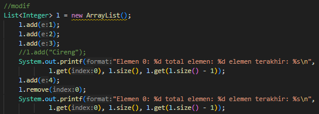
3. 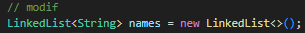
4. 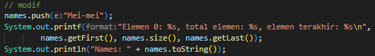
5. Terdapat 2 output yang berbeda tergantung dari lokasi kode yang ditambahkan:
    * Kode ditambahkan di akhir setelah bagian My Kid:
    
        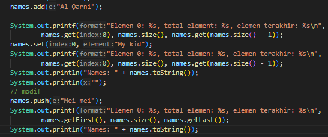

        Memiliki output seperti berikut:

        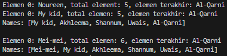

        Dari hal tersebut dapat dilihat bahwa setelah perintah push dijalankan data "Mei-mei" akan ditambahkan dalam daftar dan menjadi elemen pertama dengan indeks 0. Sehingga dapat dilihat pada output total elemen yang sebelumnya 5 kini menjadi 6 dan pada print daftar nama Mei-mei muncul pada urutan pertama.
    * Kode ditambahkan setelah names.add sebelum bagian My Kid:
    
        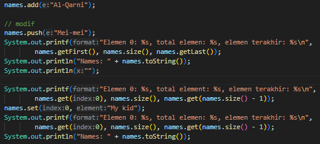

        Memiliki output seperti berikut:

        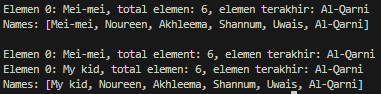

        Sebelumnya sudah ada 5 data dalam daftar lalu setelah perintah push dijalan maka data "Mei-mei" akan ditambahkan ke dalam daftar sebagai elemen pertama dengan indeks 0. Sehingga dapat dilihat daftar pertama terdapat 6 data dan Mei-mei pada urutan pertama. Namun, setelah kode bagian "My Kid" dijalankan data "Mei-mei" tergantikan dengan My kid karena "My kid" di set oada indeks 0 sedangkan indeks ke 0 ditempati oleh Mei-mei. Sehingga dapat dilihat daftar kedua data "Mei-mei" sudah tidak ada dan pada urutan pertama tergantikan oleh My kid.

## 16.3 Praktikum 2
### Pertanyaan
1. Apakah perbedaan fungsi push() dan add() pada objek fruits?
2. Silakan hilangkan baris 43 dan 44, apakah yang akan terjadi? Mengapa bisa demikian?
3. Jelaskan fungsi dari baris 46-49?
4. Silakan ganti baris kode 25, Stack<String> menjadi List<String> dan apakah yang terjadi? Mengapa bisa demikian?
5. Ganti elemen terakhir dari dari objek fruits menjadi “Strawberry”!
6. Tambahkan 3 buah seperti “Mango”,”guava”, dan “avocado” kemudian dilakukan sorting!

### Jawaban
1. * **push()** digunakan khusus untuk menambahkan elemen ke atas tumpukan dalam struktur data tumpukan (seperti yang ada dalam kelas Stack), secara spesifik menandakan penambahan elemen baru ke atas (puncak) tumpukan.
    * **add()** adalah metode umum untuk menambahkan elemen ke dalam koleksi Java. Dalam konteks Stack, meskipun add() bekerja untuk menambahkan elemen pada posisi terakhir tumpukan, dalam kasus kelas Stack spesifik, fungsionalitasnya mirip dengan push() karena Stack merupakan turunan dari kelas Vector.
2. 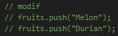

    Tidak akan ada perubahan dalam stack buah karena dua baris tersebut terdapat operasi push() guna menambahkan elemen baru ke dalam stack. Jika kedua baris itu dihapus, tidak akan ada penambahan elemen "Melon" dan "Durian" ke dalam stack fruits.
3. Baris kode 46-49 adalah penggunaan iterator untuk mengiterasi melalui tumpukan buah (fruits) dan mencetak setiap elemennya satu per satu hingga tidak ada elemen lagi yang tersisa dalam tumpukan. Ini adalah cara manual untuk menelusuri tumpukan dan mencetak nilainya.
4. Jika baris kode Stack<String> fruits = new Stack<>(); diganti menjadi List<String> fruits = new ArrayList<>();, akan terjadi perubahan dalam deklarasi variabel fruits. Seperti berikut:

    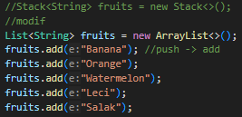

    Konsekuensinya, beberapa operasi yang khusus pada stack (seperti **push()** dan **pop()**) tidak lagi tersedia saat menggunakan List. Sebagai gantinya, dapat menggunakan metode yang umum untuk List, seperti add() untuk menambahkan elemen di akhir list.
5. 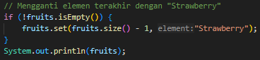
6. 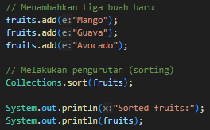

    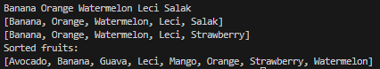

## 16.4 Praktikum 3
### Pertanyaan
1. Pada fungsi tambah() yang menggunakan unlimited argument itu menggunakan konsep apa? 
Dan kelebihannya apa?
2. Pada fungsi linearSearch() di atas, silakan diganti dengan fungsi binarySearch() dari collection!
3. Tambahkan fungsi sorting baik secara ascending ataupun descending pada class tersebut!

### Jawaban
1. Fungsi **tambah()** yang menggunakan unlimited argument (varargs) menggunakan konsep varargs dalam Java.

    Varargs (variadic arguments) memungkinkan sebuah method menerima jumlah argumen yang tidak terbatas dari jenis data yang sama. Dalam hal ini, pada method **tambah(Mahasiswa... mahasiswa)**, **Mahasiswa... mahasiswa** adalah varargs yang mengizinkan penambahan sejumlah objek **Mahasiswa** ke dalam list dengan cara yang lebih fleksibel.

    * `Kelebihan Varargs`:
        * **Fleksibilitas dalam Penggunaan**: Memungkinkan untuk memanggil method dengan jumlah argumen yang berbeda-beda tanpa harus membuat method overload untuk setiap kemungkinan jumlah argumen yang berbeda.
        * **Kemudahan Penggunaan**: Memudahkan dalam mengirimkan banyak nilai sebagai argumen tanpa perlu mengemasnya ke dalam array secara manual.
        * **Kode yang Lebih Bersih**: Meminimalisir kode karena tidak perlu membuat struktur data seperti array secara manual untuk mengirimkan argumen dalam jumlah yang bervariasi.
2. 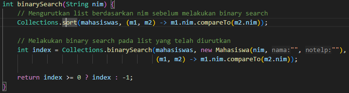
3. 

## Tugas Praktikum
### Jawaban
**Output Program :**

