# LAPORAN PRAKTIKUM 2
NAMA  : ANANDA ABIMANYU SAPUTRA

NIM   : 2241760093

KELAS : SIB 2C

## 2.2 Deklarasi Class, Atribut dan Method
### Pertanyaan
1. Sebutkan 2 karakteristik class/objek!
2. Kata kunci apakah yang digunakan untuk mendeklarasikan class?
3. Perhatikan class Film yang ada di Praktikum di atas, ada berapa atribut yang dimiliki oleh class tersebut? Sebutkan! Dan pada baris berapa saja deklarasi atribut dilakukan?
4. Ada berapa method yang dimiliki oleh class tersebut? Sebutkan!
5. Perhatikan method kurangiTiket() yang ada di class Film, modifikasi isi method tersebut sehingga proses pengurangan hanya dilakukan jika stok masih ada (masih lebih besar dari 0)!
6. Menurut Anda, mengapa method tambahTiket() dibuat dengan memiliki 1 parameter berupa bilangan int?
7. Menurut Anda, mengapa method totalRevenue() memiliki tipe data int?
8. Menurut Anda, mengapa method tambahTiket() memiliki tipe data void?

### Jawaban
1. * Terdapat Atribut yang mendefinisikan karakteristik objek atau class dan dapat berupa variabel atau data lainnya.
    * Terdapat Metode yang merupakan fungsi atau prosedur yang terkait dengan objek atau class. Metode mendefinisikan perilaku atau tindakan yang dapat dilakukan oleh objek atau class tersebut.
2. Public Class namaClass 
3. Ada 5 atribut, yakni: judul, genre, rate, jumlahTiket, hargaTiket. Pada baris ke-4 dan ke-5.
4. Ada 4, yakni: tampilTiket, tambahTiket, kurangTiket, totalRevenue.
5. 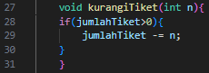 
6. Agar dapat menambah jumlah tiket yang terjual dengan sejumlah tiket yang ditentukan oleh pengguna saat memanggil metode tersebut.
7. Sebab metode ini bertujuan untuk mengembalikan nilai total pendapatan dari penjualan tiket yang merupakan nilai bulat integer.
8. Sebab metode ini hanya mengubah nilai atribut jumlahTiket dalam objek Film dan tidak perlu mengembalikan nilai apapun.

## 2.3 Instansiasi Objek dan Mengakses Atribut & Method
### Pertanyaan
1. Pada class FilmMain, pada kode apa yang digunakan untuk proses instansiasi? Apa nama objek yang dihasilkan?
2. Bagaimana cara mengakses atribut dan method dari suatu objek?

## Jawaban
1. Film film1 = new Film();  Objek yang dihasilkan film1
2. * Untuk mengakses atribut dapat dilakukan dengan namaObjek.namaAtribut = nilai; 
    * Untuk mengakses method dapat dilakukan dengan namaObjek.namaMethod();

## 2.4 Membuat Konstruktor
### Pertanyaan
1. Perhatikan class Film yang ada di Praktikum 2.4.1, pada baris berapakah deklarasi konstruktor berparameter dilakukan?
2. Perhatikan class FilmMain di Praktikum 2.4.1, apa sebenarnya yang dilakukan pada baris program dibawah ini?

    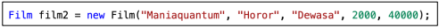
3. Coba buat objek dengan nama film3 dengan menggunakan konstruktor berparameter dari class Barang.

### Jawaban
1. Pada baris ke-10.
2. Terdapat proses Deklarasi yakni Film film2 , Intansiasi yakni = new Film , dan Inisialisasi yakni (“Maniaquantum”, “Horor”, “Dewasa”, 2000, 40000);
3. 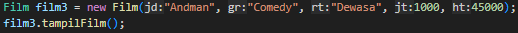

## 2.5 Membuat Array dari Object, Mengisi dan Menampilkan
### Pertanyaan
1. Berdasarkan uji coba 3.2, apakah class yang akan dibuat array of object harus selalu memiliki atribut dan sekaligus method? Jelaskan!
2. Apakah class PersegiPanjang memiliki konstruktor? Jika tidak, kenapa dilakukan pemanggilan konstruktur pada baris program berikut :

    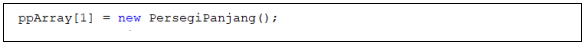
3. Apa yang dimaksud dengan kode berikut ini:

    
4. Apa yang dimaksud dengan kode berikut ini:

    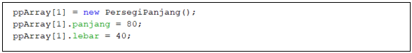
5. Mengapa class main dan juga class PersegiPanjang dipisahkan pada uji coba 3.2?

### Jawaban
1. Tidak, sebuah class yang akan digunakan sebagai array of objects tidak selalu harus memiliki atribut dan method. Pemilihan atribut dan method dalam sebuah class bergantung pada kebutuhan dan tujuan dari class tersebut. Jika hanya untuk menyimpan data dalam array, maka hanya atribut yang diperlukan. Namun, jika  ingin melakukan semacam operasi seperti menghitung nilai atau mengubah data, maka dapat menambahkan method sesuai kebutuhan.
2. Dalam kode tersebut membuat objek baru (inisialisasi) dari kelas PersegiPanjang menggunakan konstruktor default (jika ada), dan objek tersebut kemudian disimpan di dalam array ppArray pada indeks ke-1. Dengan melakukan ini, dapat menciptakan sebuah objek PersegiPanjang yang siap digunakan dalam program, dan dapat mengakses dan memanipulasi atribut dan metode objek tersebut sesuai kebutuhan.
3. Kode tersebut berguna untuk menginisialisasi sebuah array dari objek PersegiPanjang dengan nama ppArray yang memiliki panjang sebanyak 3 elemen.
4. * ppArray[1] = new PersegiPanjang(); Baris ini menginisialisasi elemen kedua (indeks 1) dari array ppArray dengan objek baru dari kelas PersegiPanjang. Dengan kata lain, membuat sebuah objek PersegiPanjang dan menyimpannya di dalam elemen kedua array ppArray.
    * ppArray[1].panjang = 80; Setelah objek PersegiPanjang dibuat dan disimpan dalam elemen kedua array ppArray, baris ini mengakses atribut panjang dari objek tersebut dan mengatur nilainya menjadi 80. Ini berarti panjang dari objek PersegiPanjang yang ada di elemen kedua array ppArray sekarang adalah 80.
    * ppArray[1].lebar = 40; Baris ini mengakses atribut lebar dari objek yang sama yang ada di elemen kedua array ppArray dan mengatur nilainya menjadi 40. Ini berarti lebar dari objek PersegiPanjang yang ada di elemen kedua array ppArray sekarang adalah 40.
5. Pemisahan tugas dan tanggung jawab antara kelas main dan kelas PersegiPanjang dapat membantu dalam mengorganisasi dan mengelola kode secara lebih efisien dan dapat membuatnya lebih mudah dipelihara, diuji, dan dikembangkan seiring berjalannya waktu.

## 2.6 Menerima Input Isian Array Menggunakan Looping
### Pertanyaan
1. Apakah array of object dapat diimplementasikan pada array 2 Dimensi?
2. Jika jawaban soal no satu iya, berikan contohnya! Jika tidak, jelaskan!
3. Jika diketahui terdapat class Persegi yang memiliki atribut sisi bertipe integer, maka kode dibawah ini akan memunculkan error saat dijalankan. Mengapa?

    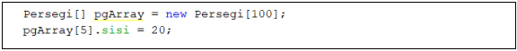
4. Modifikasi kode program pada praktikum 3.3 agar length array menjadi inputan dengan Scanner!
5. Apakah boleh Jika terjadi duplikasi instansiasi array of objek, misalkan saja instansiasi dilakukan pada ppArray[i] sekaligus ppArray[0]? Jelaskan !

### Jawaban
1. Ya, dapat mengimplementasikan array of object pada array 2 dimensi.
2. 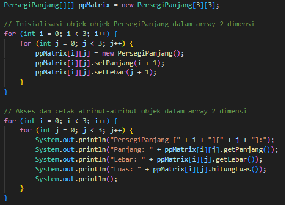
3. Sebab elemen-elemen tersebut masih belum diinisialisasi. Ketika membuat sebuah array objek seperti Persegi[] pgArray = new Persegi[100];, hanya array itu sendiri yang diinisialisasi, tetapi elemen-elemen di dalamnya (objek Persegi) tidak diinisialisasi secara otomatis. Mereka masih memiliki nilai null atau nilai default sesuai tipe data yang bersangkutan. Jadi, ketika menjalankan pgArray[5].sisi = 20;, yang akan muncul adalah error NullPointerException.
4. 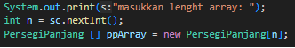
5. Tidak, dalam Java tidak dapat menginstansiasi duplikat objek di dalam array atau indeks yang sama. Ketika menginstansiasi objek pada ppArray[i] dan kemudian mencoba menginstansiasi objek lain pada indeks yang sama, yang terjadi adalah objek yang pertama akan digantikan oleh objek yang kedua. Hal tersebut terjadi karena setiap elemen array hanya dapat menyimpan satu objek atau nilai.

## 2.7 Operasi Matematika Atribut Object Array
### Pertanyaan
1. Dapatkah konstruktor berjumlah lebih dalam satu kelas? Jelaskan dengan contoh!
2. Jika diketahui terdapat class Segitiga seperti berikut ini:

    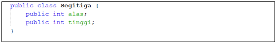

    Tambahkan konstruktor pada class Segitiga tersebut yang berisi parameter int a, int t yang masing-masing digunakan untuk mengisikan atribut alas dan tinggi.
3. Tambahkan method hitungLuas() dan hitungKeliling() pada class Segitiga tersebut. Asumsi segitiga adalah segitiga siku-siku. (Hint: Anda dapat menggunakan bantuan library Math pada Java untuk mengkalkulasi sisi miring)
4. Pada fungsi main, buat array Segitiga sgArray yang berisi 4 elemen, isikan masing-masing atributnya sebagai berikut:

    sgArray ke-0 alas: 10, tinggi: 4

    sgArray ke-1 alas: 20, tinggi: 10

    sgArray ke-2 alas: 15, tinggi: 6

    sgArray ke-3 alas: 25, tinggi: 10

    Kemudian menggunakan looping, cetak luas dan keliling dengan cara memanggil method hitungLuas() dan hitungKeliling().

### Jawaban
1. Ya, dapat memiliki lebih dari satu konstruktor dalam satu kelas. Ini disebut sebagai overloading konstruktor, dan itu memungkinkan untuk membuat objek dari kelas dengan berbagai cara atau dengan berbagai parameter. Contoh: 

    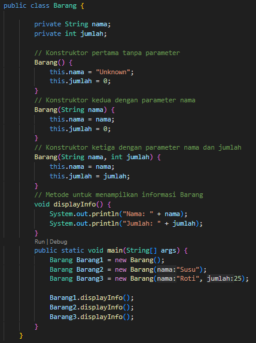

    Dalam contoh di atas, kelas Barang memiliki tiga konstruktor yang berbeda. Konstruktor pertama tidak memiliki parameter dan menginisialisasi objek dengan nilai default. Konstruktor kedua mengambil satu parameter nama, sementara konstruktor ketiga mengambil dua parameter, yaitu nama dan jumlah. Kita dapat membuat objek Barang dengan cara yang berbeda menggunakan konstruktor yang sesuai dengan kebutuhan.
2. 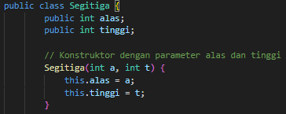
3. 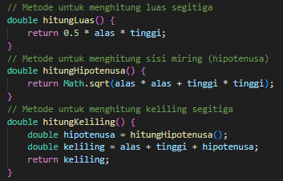
4. 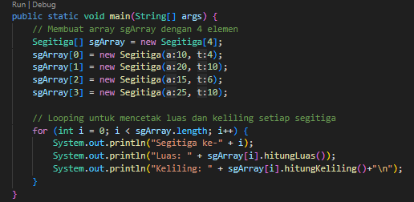

## Tugas Praktikum
### Jawaban
1. 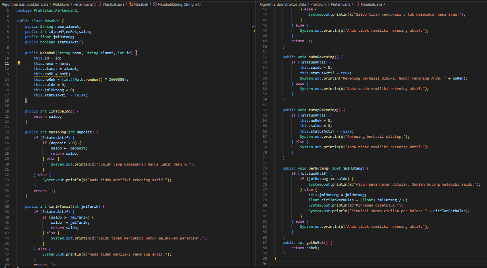
2. Berdasarkan soal nomor 1, terapkan kasus lebih dari 1 nasabah menggunakan object of array!

    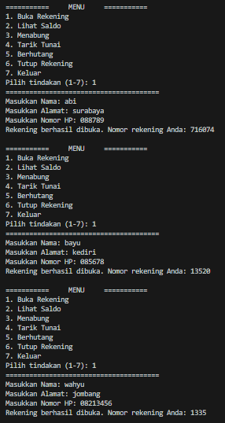
3. Berdasarkan soal nomor 1 dan 2, terapkan kasus 1 nasabah dapat memiliki lebih dari 1 rekening menggunakan array biasa! 

    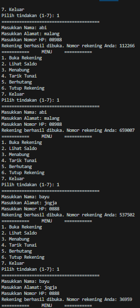