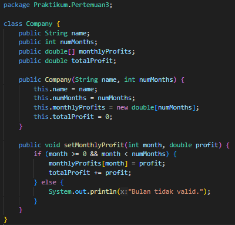

# LAPORAN PRAKTIKUM 3
NAMA  : ANANDA ABIMANYU SAPUTRA

NIM   : 2241760093

KELAS : SIB 2C

## 4.2 Menghitung Nilai Faktorial dengan Algoritma Brute Force dan Divide and Conquer
### Pertanyaan
1. Jelaskan mengenai base line Algoritma Divide Conquer untuk melakukan pencarian nilai faktorial!
2. Pada implementasi Algoritma Divide and Conquer Faktorial apakah lengkap terdiri dari 3 tahapan divide, conquer, combine? Jelaskan masing-masing bagiannya pada kode program!
3. Apakah memungkinkan perulangan pada method faktorialBF() dirubah selain menggunakan for? Buktikan!
4. Tambahkan pengecekan waktu eksekusi kedua jenis method tersebut!
5. Buktikan dengan inputan elemen yang di atas 20 angka, apakah ada perbedaan waktu eksekusi?

### Jawaban
1. * Pembagian (Divide): Dalam kasus faktorial, tidak ada pembagian masalah menjadi submasalah yang lebih kecil. Faktorial hanya melibatkan perkalian berurutan dari 1 hingga n. Tidak ada pembagian yang relevan dalam konteks ini.
    * Penyelesaian (Conquer): tidak ada penyelesaian submasalah yang harus digabungkan untuk menghitung faktorial. Setiap langkah faktorial hanya melibatkan perkalian dengan bilangan bulat positif yang berurutan. Oleh karena itu, tidak ada solusi submasalah yang perlu digabungkan.
    * Penggabungan (Combine): Algoritma Divide and Conquer melibatkan penggabungan solusi submasalah untuk membangun solusi akhir. Dalam kasus faktorial, tidak ada penggabungan yang relevan, karena setiap langkah faktorial hanya melibatkan perkalian.
2. Pada program Faktorial Tidak lengkap mengunakan tiga tahapan utama: Divide, Conquer, dan Combine. Tidak memerlukan langkah "Combine" karena hasil perhitungan setiap submasalah tidak perlu digabungkan. Sebagai gantinya, algoritma faktorial menggunakan langkah "Base Case" yang menghentikan rekursi ketika mencapai kondisi dasar.

    * Divide (Pembagian): Tahap ini terjadi ketika masalah dibagi menjadi submasalah yang lebih kecil. Dalam implementasi faktorial, tahap ini terjadi ketika kita memanggil fungsi hitungFaktorial dengan nilai n-1. Dalam kode program, ini terlihat pada bagian berikut: return n * hitungFaktorial(n - 1); Fungsi ini membagi masalah menghitung faktorial dari n menjadi masalah menghitung faktorial dari n-1.
    * Conquer (Penyelesaian): Tahap ini terjadi ketika submasalah yang lebih kecil diselesaikan secara rekursif. Dalam implementasi faktorial, tahap ini terjadi ketika kita menghitung faktorial dari n-1 dengan cara yang sama. Dalam kode program, ini terlihat pada bagian: int fakto = n * FaktorialDC(n - 1); Fungsi hitungFaktorial dipanggil kembali dengan nilai n-1 untuk menyelesaikan submasalah tersebut.
    * Combine (Penggabungan): Tahap ini biasanya terjadi ketika solusi dari submasalah yang lebih kecil digabungkan untuk mendapatkan solusi akhir dari masalah yang lebih besar. Namun, dalam kasus faktorial, tidak ada penggabungan yang perlu dilakukan. 
    * Sebaliknya, algoritma faktorial memiliki langkah "Base Case," yang adalah kondisi berhenti dari rekursi. Kondisi dasar ini adalah ketika n mencapai nilai 0. Pada saat itu, rekursi berhenti, dan hasil faktorialnya adalah 1, seperti yang terlihat dalam bagian ini: if(n == 0) {return 1;} 
    Kondisi dasar ini menghentikan rekursi dan memberikan hasil faktorial 1 ketika n mencapai 0, sehingga tidak ada pembagian, penyelesaian, atau penggabungan yang diperlukan dalam tahap "Combine" untuk menghitung faktorial.
3. Ya, dapat menggunakan while ataupun rekursif. Berikut kode dan outputnya:

       

       
4. 
5. Dari hasil percobaan saya dengan 20 elemen, terdapat perbedaan waktu eksekusi yakni 69800 nanosecond dengan Total waktu Brute Force 73700 nanosecond dan Total waktu Divide Conquer 143500 nanosecond.

    

## 4.3 Menghitung Hasil Pangkat dengan Algoritma Brute Force dan Divide and Conquer
### Pertanyaan
1. Jelaskan mengenai perbedaan 2 method yang dibuat yaitu PangkatBF() dan PangkatDC()!
2. Pada method PangkatDC() terdapat potongan program sebagai berikut:

    

    Jelaskan arti potongan kode tersebut!
3. Apakah tahap combine sudah termasuk dalam kode tersebut? Tunjukkan!
4. Modifikasi kode program tersebut, anggap proses pengisian atribut dilakukan dengan konstruktor.
5. Tambahkan menu agar salah satu method yang terpilih saja yang akan dijalankan!

## Jawaban
1. Perbedaan utama antara kedua metode tersebut terletak pada cara perhitungannya:
    * Pangkat Brute Force (pangkatBF):

        Pendekatan brute force menghitung hasil dengan mengalikan a sebanyak n kali. Metode ini menggunakan loop for yang berjalan sebanyak n kali, dan pada setiap iterasi, a dikalikan dengan hasil sebelumnya (hasil *= a). Ini adalah pendekatan yang sederhana dan langsung ke depan, tetapi bisa sangat lambat untuk nilai n yang besar karena memerlukan banyak perkalian.
    * Pangkat Divide and Conquer (pangkatDC):

        Pendekatan divide and conquer menghitung hasil dengan cara yang lebih efisien menggunakan rekursif. Metode ini memanfaatkan prinsip dasar bahwa a pangkat n dapat dipecah menjadi dua bagian: a pangkat n/2 kali a pangkat n/2 (untuk n genap) atau a pangkat n/2 kali a pangkat n/2 kali a (untuk n ganjil). Dengan membagi masalah menjadi submasalah yang lebih kecil, metode ini mengurangi jumlah perkalian yang diperlukan untuk menghitung hasil. Ini sangat efisien untuk nilai n yang besar, karena mengurangi kompleksitas perhitungan secara signifikan.
2. * if (n % 2 == 1) { // bilangan ganjil: Ini adalah kondisi yang memeriksa apakah nilai n adalah bilangan ganjil atau genap. Jika n adalah bilangan ganjil, maka kode dalam blok if akan dieksekusi.
    * return (pangkatDC(a, n/2) * pangkatDC(a, n/2) * a);: Ini adalah bagian yang dijalankan jika n adalah bilangan ganjil.
        * Memanggil rekursi untuk menghitung a pangkat n/2 dua kali (yaitu pangkatDC(a, n/2) kali pangkatDC(a, n/2)).
        * Kemudian, hasil dari kedua rekursi tersebut dikalikan dengan a. Ini karena jika n adalah ganjil, maka a pangkat n dapat dipecah menjadi a pangkat n/2 kali a pangkat n/2 kali a.
    * else { // bilangan genap: Jika kondisi if di atas tidak terpenuhi, itu berarti n adalah bilangan genap, dan kode dalam blok else akan dieksekusi.
    * return (pangkatDC(a, n/2) * pangkatDC(a, n/2));: Ini adalah bagian yang dijalankan jika n adalah bilangan genap.
        * Memanggil rekursif untuk menghitung a pangkat n/2 dua kali (yaitu pangkatDC(a, n/2) kali pangkatDC(a, n/2)).
        * Karena n adalah bilangan genap, tidak perlu mengalikan hasilnya dengan a, cukup mengalikan kedua hasil rekursi tersebut.
3. Ya, pada bagian 'return (pangkatDC(a, n/2) * pangkatDC(a, n/2) * a);'  Saat n adalah bilangan ganjil 

    dan 'return (pangkatDC(a, n/2) * pangkatDC(a, n/2));'  Saat n adalah bilangan genap

    
4.   

     
5.  

## 4.4 Menghitung Sum Array dengan Algoritma Brute Force dan Divide and Conquer
### Pertanyaan
1. Berikan ilustrasi perbedaan perhitungan keuntungan dengan method TotalBF() ataupun TotalDC()!
2. Perhatikan output dari kedua jenis algoritma tersebut bisa jadi memiliki hasil berbeda di belakang koma. Bagaimana membatasi output di belakang koma agar menjadi standar untuk kedua jenis algoritma tersebut.
3. Mengapa terdapat formulasi return value berikut? Jelaskan!

    
4. Kenapa dibutuhkan variable mid pada method TotalDC()?
5. Program perhitungan keuntungan suatu perusahaan ini hanya untuk satu perusahaan saja. Bagaimana cara menghitung sekaligus keuntungan beberapa bulan untuk beberapa perusahaan. (Setiap perusahaan bisa saja memiliki jumlah bulan berbeda-beda)? Buktikan dengan program!

### Jawaban
1. Misalkan kita memiliki data keuntungan per bulan selama 6 bulan: 3.5, 2.8, 4.2, 3.0, 5.1, 2.7. 
    * Metode Brute Force (TotalBF()): Menjumlahkan semua keuntungan secara berurutan, seperti ini:
    
        Total keuntungan = 3.5 + 2.8 + 4.2 + 3.0 + 5.1 + 2.7 = 21.3 juta

        Dengan metode Brute Force, kita menjumlahkan semua elemen array secara berurutan, yang memerlukan waktu linear (O(n)) di mana 'n' adalah jumlah bulan.
    * Metode Divide and Conquer (TotalDC()): Membagi data menjadi dua bagian dan menghitung total keuntungan dalam setiap bagian secara terpisah, lalu menggabungkannya. Ilustrasinya sebagai berikut:

        - Bagian 1 (kiri):

            * Bulan 1: 3.5 juta
            * Bulan 2: 2.8 juta
            * Bulan 3: 4.2 juta
            * Total bagian 1 = 3.5 + 2.8 + 4.2 = 10.5 juta

        - Bagian 2 (kanan):

            * Bulan 4: 3.0 juta
            * Bulan 5: 5.1 juta
            * Bulan 6: 2.7 juta
            * Total bagian 2 = 3.0 + 5.1 + 2.7 = 10.8 juta

        - Gabungan:
            * Total keuntungan = Total bagian 1 + Total bagian 2 = 10.5 + 10.8 = 21.3 juta

        Metode ini memiliki kompleksitas waktu O(n log n) dalam hal ini, yang lebih efisien daripada metode Brute Force untuk jumlah data yang besar.
2. Dapat menggunakan printf untuk mengontrol format output.

    

    Dalam kode di atas, saya menggunakan printf untuk mengontrol format output dengan %.2f, yang berarti dua digit di belakang koma. Dengan ini, output untuk kedua jenis algoritma akan memiliki hasil yang sama dengan dua digit di belakang koma. Dapat mengganti 2 dengan jumlah digit desimal yang sesuai jika Anda ingin mengatur jumlah digit desimal yang berbeda.

3. Digunakan untuk menghitung total keuntungan dari array keuntungan. 
    * lsum: Hasil rekursif dari perhitungan total keuntungan pada bagian kiri (bagian sebelah kiri dari array yang dibagi).
    * rsum: Hasil rekursif dari perhitungan total keuntungan pada bagian kanan (bagian sebelah kanan dari array yang dibagi).
    * arr[mid]: Nilai keuntungan pada titik tengah array yang menjadi penghubung antara bagian kiri dan kanan.

4. Variabel mid digunakan dalam metode totalDC() untuk menentukan indeks tengah dari array. Ini penting karena:

    * Digunakan untuk membagi array menjadi dua bagian yang lebih kecil saat memecahkan masalah.
    * Digunakan untuk mengakses nilai tengah array yang berguna dalam menghitung total keuntungan.
    * Membantu algoritma Divide and Conquer memisahkan, menghitung, dan menggabungkan hasil dengan efisien.
5.  

    

## Latihan Praktikum
### Jawaban
1. 