# LAPORAN JOBSHEET 4
NAMA  : ANANDA ABIMANYU SAPUTRA

NIM   : 2241760093

KELAS : SIB 2C

## 4.2 Praktikum 1
### Pertanyaan
1. Perhatikan class MahasiswaMain, jelaskan fungsi kode program berikut ini!

    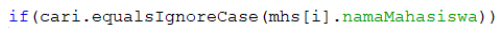
2. Lakukan modifikasi pada program tersebut, sehingga jika data yang dicari tidak ditemukan, maka akan menampilkan “Data tidak ditemukan”!
3. Lakukan modifikasi pada program tersebut agar pencarian dilakukan bukan berdasarkan nama mahasiswa, melainkan berdasarkan IPK!

### Jawaban
1. Pada perintah if dengan kondisi atau syarat bahwa data variable cari sama dengan array objek mhs attribute namaMahasiswa yang akan dibandingkan dengan data variable cari yaitu input dari user dengan mengabaikan besar kecilnya huruf.
2. 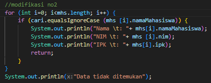 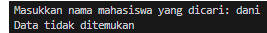
3. 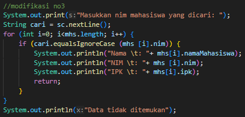 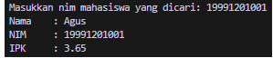

## 4.3 Praktikum 2
### Pertanyaan
1. Perhatikan class PencarianMain, jelaskan fungsi dari kode kode program berikut ini!

    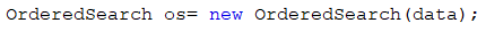
2. Perhatikan class Pencarian, pada method Cari terdapat dua kali break. Jelaskan fungsi masing-masing break tersebut pada kode program tersebut!
3. Lakukan modifikasi pada program tersebut sehingga data array dapat bersifat dinamis (dapat diinputkan oleh pengguna)!

## Jawaban
1. Kode program adalah instansiasi objek yang berfungsi untuk menjalankan fungsi OrderedSearch pada class OrderedSearch dengan data dari array data dan disimpan pada variable os.
2. Fungsi break berguna untuk menghentikan kode/program, pada hal ini diberlakukan pada method cari. Pada kondisi pertama membandingkan data dari keyword apakah sama dengan data dalam array arr jika kondisi 1 true nilai index menjadi i dan menghentikan program perulangan. Pada kondisi berikutnya membandingkan data dari keyword apakah lebih kecil dari data dalam array arr index i jika true maka langsung menghentikan program perulangan sehingga tak perlu membandingkan data di index berikutnya.
3. 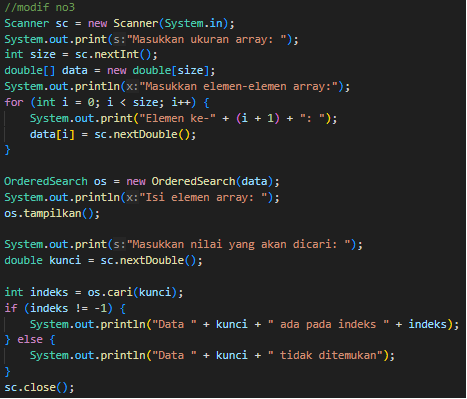 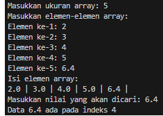

## Tugas Praktikum
### Jawaban
1. 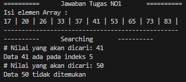
2. 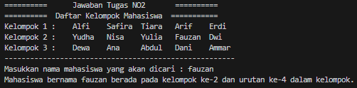
3. 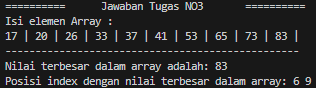
4. 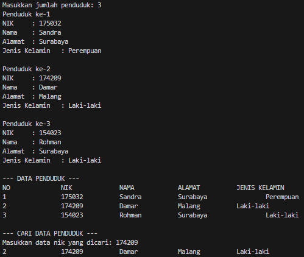