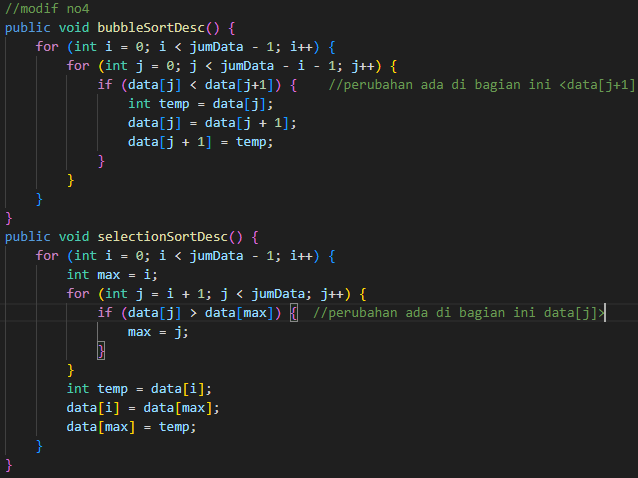

# LAPORAN JOBSHEET 5 SORTING
NAMA  : ANANDA ABIMANYU SAPUTRA

NIM   : 2241760093

KELAS : SIB 2C

## 5.2 Mengimplementasikan Sorting menggunakan Object
### Pertanyaan
1. Jelaskan maksud dari kode berikut!

    
2. Jelaskan fungsi kode program berikut!

    
3. Tunjukkan kode program yang merupakan algoritma pencarian nilai minimum pada selection sort!
4. Kerjakan kembali program pengurutan menggunakan algoritma bubble sort dan  SelectionSort di atas dengan pengurutan secara DESC!

### Jawaban
1. Kode tersebut digunakan untuk menginisialisasi objek 'urut' dari kelas BubbleSort dengan parameter a dan a.length.
2. kode ini melakukan pertukaran dua elemen dalam array untuk mengurutkan elemen secara berurutan dengan algoritma Bubble Sort.
    * temp = data[j]; Nilai elemen array di indeks j disimpan ke variabel temp untuk menyimpan nilai sementara sebelum ditukar dengan elemen lain.
    * data[j] = data[j-1]; Nilai elemen array di indeks j-1 diubah menjadi nilai elemen array di indeks j. Nilai yang lebih kecil dari elemen pada indeks j-1 ditempatkan di sebelah kiri. (proses pertukaran)
    * data[j-1] = temp; Nilai yang disimpan di temp (nilai asli di indeks j) ditukar dengan nilai elemen array di indeks j-1. (Elemen yang lebih besar dipindahkan ke kanan)
3. Kode program yang merupakan algoritma pencarian nilai minimum pada selection sort terdapat pada line ke-27 hingga line ke-31.

    
4.  

## 5.3 Praktikum 2 (Menggunakan Array of Object)
### Pertanyaan
1. Tunjukkan proses pencarian nilai minimum pada algoritma Selection Sort yang telah dipraktikkan pada pertemuan ini (bukti screen shoot kode program dan penjelasan)!
2. Jelaskan perbedaan proses swap yang terjadi pada Bubble Sort dengan Selection Sort!
3. Di dalam method bubbleSort(), terdapat baris program seperti di bawah ini:

    

    Jelaskan tujuan dari baris program tersebut!
4. Perhatikan perulangan di dalam bubbleSort() di bawah ini:

    

    a. Apakah perbedaan antara kegunaan perulangan i dan perulangan j? 

    b. Mengapa syarat dari perulangan i adalah i<listMhs.length-1 ?

    c. Mengapa syarat dari perulangan j adalah j<listMhs.length-i ?

    d. Jika banyak data di dalam listMhs adalah 50, maka berapakali perulangan i akan berlangsung? Dan ada berapa Tahap bubble sort yang ditempuh?
5. Di dalam method selection sort, terdapat baris program seperti di bawah ini:

        

    Untuk apakah proses tersebut?

## Jawaban
1. Kode program yang merupakan algoritma pencarian nilai minimum pada selection sort terdapat pada line ke-36 hingga line ke-40.

    

    Dalam kode di atas, pencarian nilai minimum dilakukan dengan membandingkan atribut 'ipk' dari objek 'listMhs'. Jika 'ipk' pada indeks 'j' lebih kecil dari 'ipk' pada indeks 'idxMin', maka 'idxMin' akan diupdate ke 'j'.
2. **Bubble Sort:**
    * membandingkan angka satu per satu di dalam daftar/array dan menggeser mereka jika perlu dan dilakukan berulang kali sampai seluruh daftar sudah terurut.
    * Saat dua angka berturut-turut perlu ditukar, yang lebih besar digeser ke posisi berikutnya dan yang lebih kecil digeser ke posisi sebelumnya.
    * Tukar dilakukan jika angka di sebelah kiri lebih besar daripada angka di sebelah kanan.

    **Selection Sort:**
    * Mencari angka terkecil di dalam daftar dan menukarnya dengan angka di posisi awal yang belum diurutkan dan dilakukan berulang kali untuk mengurutkan seluruh daftar.
    * Ketika angka terkecil ditemukan, angka tersebut ditukar dengan angka di posisi yang belum diurutkan (paling kiri).
    * Angka terkecil dipindahkan ke awal, dan angka yang semula ada di awal dipindahkan ke posisi dimana angka terkecil tadi berada.

3. Baris program di atas digunakan untuk mengurutkan array 'listMhs' berdasarkan atribut 'ipk' dari objek 'Mahasiswa'. Lebih jelasnya, baris tersebut bertujuan untuk melakukan pertukaran (swap) dua elemen dalam array apabila elemen di indeks 'j' memiliki 'ipk' yang lebih besar dibandingkan dengan elemen di indeks 'j-1'.
4.  **(a.)** 
    * Perulangan i digunakan untuk melintasi seluruh array listMhs dan memastikan bahwa setiap elemen diurutkan dengan benar.
    * Perulangan j digunakan untuk melakukan perbandingan dan pertukaran antara elemen saat melintasi array. Setiap iterasi j akan membandingkan dan menukar elemen yang diperlukan.

    **(b.)**
    * Syarat ini digunakan agar perulangan i melintasi array hingga elemen kedua terakhir.
    * Setelah semua iterasi dengan i selesai, elemen terakhir pasti sudah berada pada posisi yang tepat, sehingga tidak perlu dilakukan iterasi lagi.

    **(c.)**
    * Syarat ini digunakan agar perulangan j hanya membandingkan elemen yang belum diurutkan.
    * Pada setiap iterasi i, elemen terakhir sudah terurut, sehingga tidak perlu membandingkan lagi.

    **(d.)**
    * Jika banyak data dalam listMhs adalah 50, maka perulangan i akan berlangsung sebanyak listMhs.length-1 kali.
    * Dalam Bubble Sort, setiap iterasi i membawa elemen terbesar (atau terkecil, tergantung pada urutan) ke posisi yang benar. Oleh karena itu, jumlah tahap Bubble Sort adalah listMhs.length-1.
5. Tujuan dari kode diatas untuk mencari elemen terkecil dalam bagian yang belum diurutkan dari array listMhs. Dengan melakukan perulangan dari i+1 hingga akhir array, kita mencari elemen terkecil berdasarkan atribut ipk dari objek Mahasiswa dan memperbarui idxMin dengan indeks elemen terkecil yang ditemukan.

Setelah iterasi selesai, elemen terkecil akan diidentifikasi dan dapat dipertukarkan dengan elemen pertama yang belum diurutkan pada saat itu. Inilah inti dari algoritma Selection Sort, yaitu memilih elemen terkecil secara berulang dan menukarkannya dengan elemen yang belum diurutkan.

## Tugas Praktikum
### Jawaban
1. 
2. 
3. a.  

    b. 
    
    c. 

    Output: 

    
