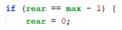
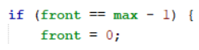
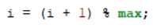
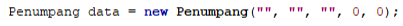
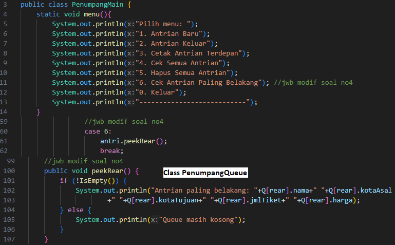
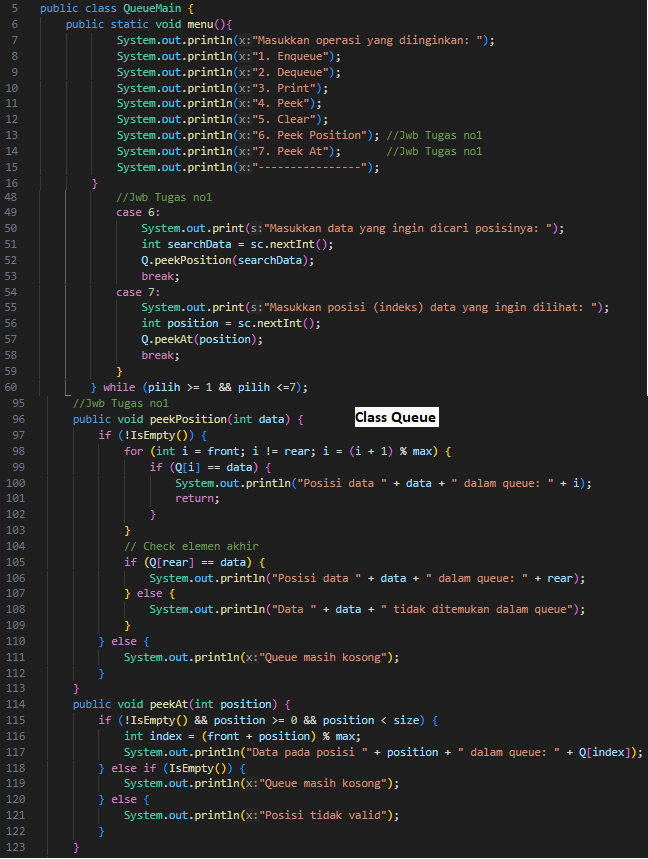
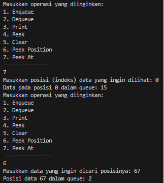
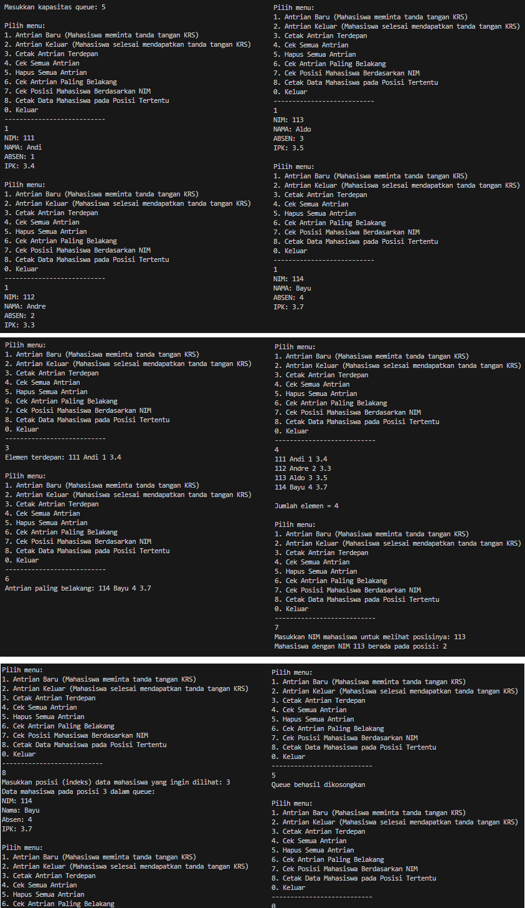

# LAPORAN JOBSHEET 8 QUEUE
***NAMA  : ANANDA ABIMANYU SAPUTRA***

***NIM   : 2241760093***

***KELAS : SIB 2C***

## 7.2 Praktikum 1
### Pertanyaan
1. Pada method **Create**, mengapa atribut front dan rear diinisialisasi dengan nilai -1, tidak 0?    
2. Pada method **Enqueue**, jelaskan maksud dan kegunaan dari potongan kode berikut!

    
3. Perhatikan kembali method **Enqueue**, baris kode program manakah yang menunjukkan bahwa data baru disimpan pada posisi terakhir di dalam queue?
4. Perhatikan kembali method **Dequeue**, baris kode program manakah yang menunjukkan bahwa data yang dikeluarkan adalah data pada posisi paling depan di dalam queue?
5. Pada method **Dequeue**, jelaskan maksud dan kegunaan dari potongan kode berikut!

    
6. Pada method **print**, mengapa pada proses perulangan variabel i tidak dimulai dari 0 **(int i=0)**, melainkan **int i=front**?
7. Perhatikan kembali method **print**, jelaskan maksud dari potongan kode berikut!

    

### Jawaban
1. Kedua atribut tersebut diinisialisasi dengan nilai -1 sebagai representasi awal bahwa queue masih kosong (tanpa elemen). Hal ini disebabkan indeks array dimulai dari 0. Jadi, jika front dan rear diinisialisasi dengan 0, itu akan menandakan bahwa ada elemen di posisi 0, yang sebenarnya belum ada.
2. Kode tersebut memeriksa apakah posisi **rear** sudah mencapai batas maksimal array **(max - 1)**, yang menunjukkan bahwa array sudah penuh atau telah mencapai batas akhir. Jika posisi **rear** sudah mencapai batas maksimal, maka **rear** diatur kembali ke awal array (indeks 0) sehingga elemen-elemen baru dapat dimasukkan di awal array. Hal ini mengimplementasikan konsep antrian yang berputar (circular queue).

    Dengan demikian, array yang digunakan untuk mewakili queue tetap efisien dan dapat terus digunakan tanpa harus mengosongkan seluruh array ketika mencapai batas akhir.
3. Pada method Enqueue dalam kelas Queue kode program yang menunjukkan bahwa data baru disimpan pada posisi terakhir adalah **Q[rear] = data;**. rear merupakan posisi terakhir dalam queue. 
4. Pada method Dequeue dalam kelas Queue kode program yang menunjukkan proses pengeluaran data dari posisi paling depan adalah **data = Q[front];**. Data pada posisi **front** adalah data yang pertama kali dimasukkan dan harus dikeluarkan (dequeue) sesuai dengan prinsip queue. 
5. Kode tersebut memeriksa apakah front (posisi depan dalam array) sudah mencapai batas maksimal (max - 1). Jika iya, itu berarti kita telah mencapai akhir dari array (posisi terakhir dalam array).

    Jika front mencapai akhir array (indeks akhir), kode tersebut mengatur front kembali ke posisi awal (indeks 0). Hal ini perlu dilakukan untuk membuat queue bersifat circular, yaitu dapat melanjutkan penambahan elemen baru dari awal array setelah mencapai akhir array.
    Dengan mengatur front kembali ke indeks 0, dapat dipastikan bahwa jika data telah dikeluarkan dari posisi paling depan dan front mencapai akhir array, maka elemen berikutnya yang dimasukkan akan berada di posisi awal array (antrian melingkar).
6. Sebab dalam queue, elemen yang dimasukkan pertama kali (elemen pertama) adalah elemen yang harus dicetak pertama kali saat mencetak/mengeluarkan antrian **(prinsip FIFO)**. Dengan memulai perulangan dari **front**, kita dapat mencetak elemen-elemen antrian sesuai dengan urutan mereka di dalam antrian, dimulai dari elemen pertama.
7. Kode tersebut adalah cara untuk memajukan variabel i ke elemen berikutnya dalam antrian secara melingkar untuk perulangan.
    * **i** adalah indeks saat ini yang menunjukkan posisi elemen dalam array queue.
    * **(i + 1)** menggerakkan indeks ke elemen berikutnya dalam array.
    * **% max** memastikan agar indeks tidak melewati batas maksimum (jumlah total elemen dalam array antrian). Jika indeks mencapai batas maksimum, operasi ini membawa kembali indeks ke awal array (melakukan perulangan).

## 7.3 Praktikum 2
### Pertanyaan
1. Perhatikan class Queue, apa fungsi kode program berikut pada method Dequeue?

    
2. Pada soal nomor 1, apabila kode program tersebut diganti dengan kode berikut:
    
    **Penumpang data = new Penumpang();**

    Apakah yang terjadi? Mengapa demikian?
3. Tunjukkan kode program yang digunakan untuk menampilkan data yang dikeluarkan dari queue!
4. Lakukan modifikasi program dengan menambahkan method baru bernama **peekRear** pada class Queue yang digunakan untuk mengecek antrian yang berada di posisi belakang! Tambahkan pula daftar menu **5. Cek Antrian paling belakang** pada class **QueueMain** sehingga method **peekRear** dapat dipanggil!

## Jawaban
1. Fungsi kode program tersebut untuk inisialisasi objek Penumpang dengan parameter yang bernilai default yaitu String yang berupa **""** dan int yang berupa **0**. Dengan parameter default, nilai-nilai ini akan diganti dengan nilai dari penumpang yang akan dikeluarkan dari antrian. Jika antrian kosong, maka nilai-nilai default ini akan tetap, dan objek ini akan dikembalikan.
2. Akan terjadi error karena program menghasilkan kesalahan kompilasi. Hal ini terjadi karena di kelas **Penumpang**, tidak ada konstruktor default tanpa parameter. Dalam kelas **Penumpang**, terdapat konstruktor khusus Penumpang(String nm, String kA, String kT, int jml, int hrg) yang harus digunakan untuk membuat objek Penumpang dengan parameter yang sesuai.

    Jika ingin menggunakan konstruktor tanpa parameter, maka perlu membuatnya terlebih dahulu pada kelas **Penumpang** yakni **public Penumpang(){}**. Setelah itu, baru dapat menjalankan **Penumpang data = new Penumpang();** tanpa menghasilkan error.
3. Untuk menampilkan data yang dikeluarkan dari queue dapat menggunakan method **Peek** dari kelas **PenumpangQueue**. Method ini digunakan untuk mencetak data penumpang yang berada di depan antrian tanpa menghapusnya. Untuk menjalankan/memanggil method **Peek** dapat menggunakan kode **antri.Peek();** pada kelas **PenumpangMain**.
4. 

## Tugas Praktikum
### Jawaban
1.   
2. 