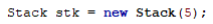
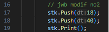
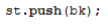
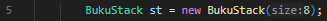
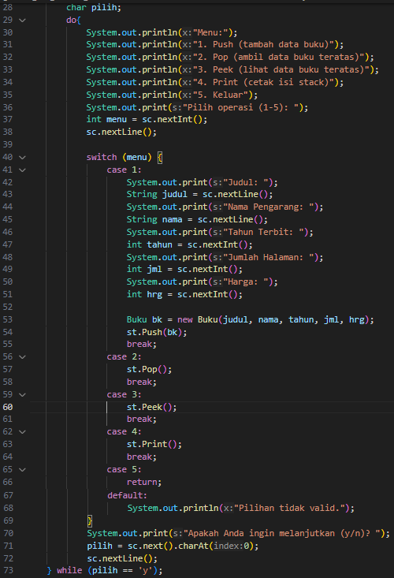
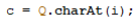
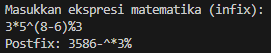
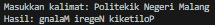
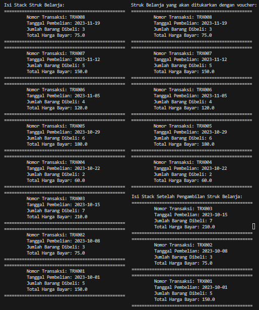

# LAPORAN JOBSHEET 7 STACK
NAMA  : ANANDA ABIMANYU SAPUTRA

NIM   : 2241760093

KELAS : SIB 2C

## 7.2 Praktikum 1
### Pertanyaan
1. Perhatikan class StackMain, apakah fungsi angka 5 pada potongan kode program berikut?

    
2. Lakukan penambahan data ke stack sebanyak dua kali, menggunakan angka 18 dan 40. Tampilkan hasilnya!
3. Pada soal nomor 2, mengapa data yang dimasukkan ke dalam Stack hanya angka 18, sedangkan angka 40 tidak dimasukkan? Jelaskan!

### Jawaban
1. Angka 5 adalah parameter yang diberikan saat membuat objek dari kelas Stack. Parameter ini mengacu pada ukuran stack atau panjang array yang akan digunakan untuk menyimpan elemen-elemen dalam stack. Dengan demikian, stack memiliki kapasitas maksimum 5 elemen.
2. 
3. Hal tersebut terjadi karena stack sudah penuh sebab stack hanya memiliki kapasistas untuk menyimpan data sebanyak 5 elemen. Pada kode sebelumnya, terdapat 5 data yang dimasukkan dan 1 yang dikeluarkan sehingga tersisa 1 slot kosong yang dapat digunakan menyimpan data. Pada soal nomor 2 diinstruksikan untuk menambahkan data sebanyak 2 kali yakni angka 18 dan 40, padahal slot yang tersedia hanya 1. Oleh sebab itu, ketika angka 18 disimpan stack sudah penuh dan tidak dapat menyimpan angka 40.

## 7.3 Praktikum 2
### Pertanyaan
1. Perhatikan class **StackMain**, pada saat memanggil fungsi push, parameter yang dikirimkan adalah **bk**. Data apa yang tersimpan pada variabel **bk** tersebut?

    
2. Tunjukkan potongan kode program untuk menentukan kapasitas penampungan stack!
3. Apakah fungsi penggunaan **do-while** yang terdapat pada class **StackMain**?
4. Modifikasi kode program pada class **StackMain** sehingga pengguna dapat memilih operasi-operasi pada stack (push, pop, peek, atau print) melalui pilihan menu program!

## Jawaban
1. Ada 5 data yang disimpan, data tersebut berasal dari input user, yakni: judul buku, Nama pengarang buku, Tahun terbit buku, Jumlah halaman buku, Harga buku.
2. 
3. Penggunaan do-while pada class BukuMain digunakan untuk melakukan perulangan terhadap proses input data buku ke dalam stack. do-while memastikan bahwa setidaknya satu iterasi akan dilakukan atau menjalankan blok perintah di dalam do-while terlebih dahulu, dan pengguna diberi kesempatan untuk memasukkan data buku ke dalam stack. Setelah itu, pengguna memiliki opsi untuk melanjutkan dengan memasukkan 'y' atau menghentikan penambahan data buku ke dalam stack dengan memasukkan 'n' dan iterasi dihentikan lalu program melanjutkan ke perintah-perintah berikutnya setelah do-while.
4. 

## 7.3 Praktikum 3
### Pertanyaan
1. Perhatikan class **Postfix**, jelaskan alur kerja method **derajat**!
2. Apa fungsi kode program berikut?

    
3. Jalankan kembali program tersebut, masukkan ekspresi **3*5^(8-6)%3**. Tampilkan hasilnya!
4. Pada soal nomor 2, mengapa tanda kurung tidak ditampilkan pada hasil konversi? Jelaskan!

### Jawaban
1. * Method derajat menerima satu karakter c sebagai parameter. Karakter ini biasanya akan menjadi operator dalam ekspresi matematika.
    * Dalam method ini, terdapat sebuah switch statement yang digunakan untuk menentukan tingkat prioritas operator berdasarkan karakter c.
    * Setiap kasus dalam switch statement mewakili operator matematika yang berbeda (seperti '^', '%', '/', '*', '-', dan '+'). Setiap kasus mengembalikan tingkat prioritas sebagai hasil.
    * Operator '^' memiliki prioritas tertinggi dengan tingkat prioritas 3.
    * Operator '%' dan '/' memiliki tingkat prioritas 2.
    * Operator '*' memiliki tingkat prioritas 2.
    * Operator '-' dan '+' memiliki tingkat prioritas terendah dengan tingkat prioritas 1.
    * Jika karakter c bukan merupakan salah satu operator yang terdaftar di dalam switch statement, maka method derajat mengembalikan 0, yang menandakan bahwa karakter tersebut bukan merupakan operator matematika.
2. Kode program tersebut digunakan untuk mengambil karakter dari string Q pada posisi indeks i dan kemudian menyimpan karakter tersebut dalam variabel c.
3. 
4. Tanda kurung tidak ditampilkan dalam hasil konversi postfix karena perannya hanya untuk mengatur urutan (prioritas) operasi dalam notasi infix. Dalam notasi postfix, urutan operasi ditentukan oleh posisi operator-operator, sehingga tanda kurung tidak diperlukan dalam hasil akhir (output). Maka, dalam proses konversi, tanda kurung diabaikan, dan hanya operator-operator dan operand yang dimasukkan ke dalam hasil postfix (output).

## Tugas Praktikum
### Jawaban
1. 
2. 