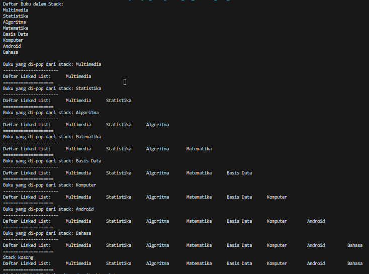

# LAPORAN JOBSHEET 9 LINKED LIST
NAMA  : ANANDA ABIMANYU SAPUTRA

NIM   : 2241760093

KELAS : SIB 2C

## 9.2 Praktikum 1
### Pertanyaan
1. Mengapa hasil compile kode program di baris pertama menghasilkan “Linked List Kosong”?
2. Pada step 10, jelaskan kegunaan kode berikut!
    
    
3. Perhatikan class SingleLinkedList, pada method insertAt Jelaskan kegunaan kode berikut!
    
    

### Jawaban
1. Hal tersebut terjadi karena setelah membuat instansiasi menghasilkan linked list kosong. Lalu memanggil method print() untuk menampilkan isi linked list pada linked list yang masih kosong tersebut. Pada akhirnya mencetak pesan "Linked List Kosong" karena belum memiliki elemen.
2. * **ndInput.next = temp.next;**: Mengatur node baru (**ndInput**) untuk menunjuk ke node yang sebelumnya ditunjuk oleh **temp** (node setelah node yang sedang dipegang).
    * **temp.next = ndInput;**: Mengatur node yang sedang dipegang (**temp**) untuk menunjuk ke node baru (**ndInput**), sehingga menyisipkannya ke dalam linked list setelah **temp**. 
     
    Hasil dari kedua baris kode ini adalah memasukkan **ndInput** di antara node **temp** dan node yang semula ditunjuk oleh **temp** dalam linked list.
3. Kode tersebut digunakan untuk memeriksa apakah node yang akan dimasukkan berada di posisi terakhir dalam linked list. Jika iya, maka tail (ekor dari linked list) diperbarui untuk menunjuk ke node baru tersebut.

## 9.3 Praktikum 2
### Pertanyaan
1. Mengapa digunakan keyword break pada fungsi remove? Jelaskan!
2. Jelaskan kegunaan kode dibawah pada method remove!
    
    
3. Apa saja nilai kembalian yang dapat dikembalikan pada method indexOf? Jelaskan maksud masing-masing kembalian tersebut!

## Jawaban
1. Keyword break digunakan untuk menghentikan iterasi melalui linked list setelah operasi penghapusan node yang diinginkan selesai dilakukan. Ini mempercepat proses dan mencegah operasi lebih lanjut setelah penghapusan yang tidak diperlukan.
2. * **temp.next.data == key**: Kode ini memeriksa apakah data pada node yang berada setelah **temp** (node saat ini) adalah sama dengan key, yang menunjukkan bahwa node yang ingin dihapus ditemukan.

        Jika pernyataan tersebut benar, artinya telah menemukan node yang ingin dihapus, dan ingin menghapus node tersebut. Oleh karena itu, dilakukan tindakan berikut:

    * **temp.next = temp.next.next;**: Kode ini menghapus node yang ingin dihapus dengan mengubah referensi next dari node temp (node saat ini) untuk menunjuk ke node setelah node yang ingin dihapus (temp.next.next). Dengan melakukan ini, node yang ingin dihapus tidak lagi dihubungkan dengan linked list, dan secara efektif dihapus dari urutan.
3. Mengembalikan satu nilai dari dua kemungkinan:
    * **Nilai indeks >= 0**:
        
        Jika metode **indexOf** menemukan node dengan nilai yang sama dengan **key**, maka ia akan mengembalikan indeks dari node tersebut. Indeks dimulai dari 0 untuk node pertama, 1 untuk node kedua, dan seterusnya. Nilai indeks ini mencerminkan posisi node yang memiliki nilai yang sama dengan **key** dalam linked list.
    * **Nilai -1**:
        
        Jika metode **indexOf** tidak menemukan node dengan nilai yang sama dengan **key** dalam linked list, maka ia akan mengembalikan nilai -1. Ini adalah tanda bahwa **key** tidak ditemukan dalam linked list.

## Tugas Praktikum
### Jawaban
1. 
2. * Pada class SingleLinkedList mengubah tipe data parameter dari method addFirst,addLast,InsertAfter,InsertAt,InsertBefore dan dari int menjadi char atau String: 

    

    * Pada class Node mengubah tipe data dari var data dan parameter dari konstruktor Node dan dari int menjadi char atau String: 

    

    * Output:

    
3. 
4. 
5. 