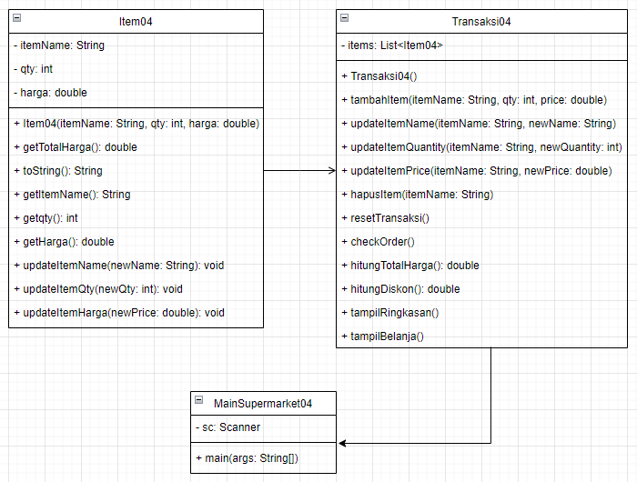
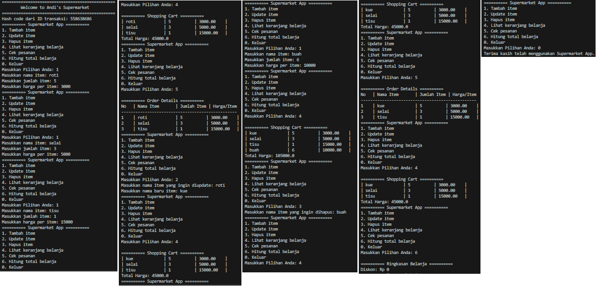

# LAPORAN QUIZ 1
NAMA  : ANANDA ABIMANYU SAPUTRA

NIM   : 2241760093

KELAS : SIB 2C

## Flow chart / Class Diagram

## Fungsi-fungsi yang digunakan beserta penjelasan alur kerjanya
### Item04 Class:
1. getTotalHarga(): Mengembalikan total harga item berdasarkan jumlah dan harga per item.
2. toString(): Menghasilkan representasi string dari objek item untuk ditampilkan.
3. getItemName(): Mengembalikan nama item.
4. getQty(): Mengembalikan jumlah item.
5. getHarga(): Mengembalikan harga per item.
6. updateItemName(String newName): Memperbarui nama item.
7. updateItemQty(int newQty): Memperbarui jumlah item.
8. updateItemHarga(double newPrice): Memperbarui harga per item.

### Transaksi04 Class:
1. tambahItem(String itemName, int qty, double price): Menambahkan item baru ke daftar belanja.
2. updateItemName(String itemName, String newName): Mengupdate nama item.
3. updateItemQuantity(String itemName, int newQuantity): Mengupdate jumlah item.
4. updateItemPrice(String itemName, double newPrice): Mengupdate harga per item.
5. hapusItem(String itemName): Menghapus item dari daftar belanja.
6. resetTransaksi(): Menghapus semua item dari daftar belanja, mereset transaksi.
7. checkOrder(): Menampilkan detail pesanan.
8. hitungTotalHarga(): Menghitung total harga dari seluruh belanjaan.
9. hitungDiskon(): Menghitung diskon berdasarkan total harga belanja.
10. tampilRingkasan(): Menampilkan ringkasan belanja dengan total harga dan diskon.
11. tampilBelanja(): Menampilkan daftar belanja beserta total harga.

### MainSupermarket04 Class:
1. main(String[] args): Entry point program, memulai aplikasi supermarket dengan menampilkan menu dan mengelola transaksi berdasarkan pilihan user.
2. Pada method main, digunakan Scanner untuk membaca input dari user dan menjalankan transaksi supermarket sesuai dengan pilihan yang dimasukkan. Input yang tidak valid akan ditangkap dengan try-catch block.

### Penjelasan Alur Kerjanya
Alur kerja program dimulai dengan menyambut user dan membuat objek Transaksi04 untuk merepresentasikan transaksi. Selanjutnya, program akan menampilkan menu dan meminta user untuk memasukkan pilihan. Berdasarkan pilihan user, program akan melakukan aksi seperti menambah item, mengupdate item, menghapus item, dan menampilkan ringkasan belanja. Program akan terus berjalan hingga user memilih untuk keluar (pilihan 0). Selama berjalan, program menggunakan try-catch untuk menangkap kesalahan saat membaca pilihan user dan memastikan input yang valid.

## Dokumentasi Pekerjaan
Swafoto:

Coding:

Output:

