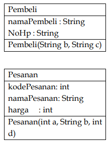
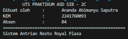
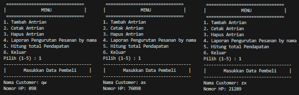
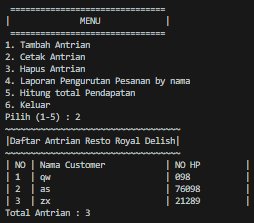
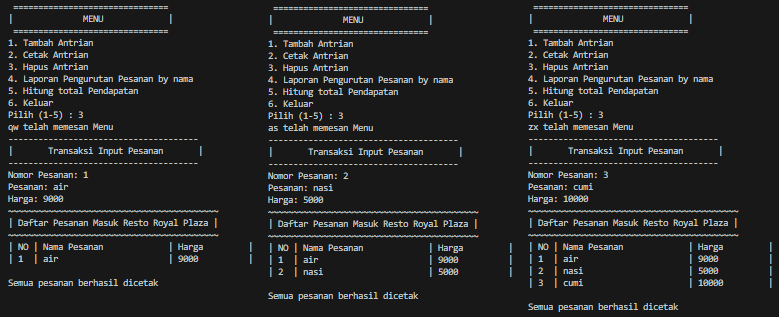
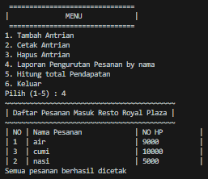
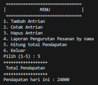

# LAPORAN UTS ASD
NAMA  : ANANDA ABIMANYU SAPUTRA

NIM   : 2241760093

KELAS : SIB 2C

## Latar Belakang

Membuat sebuah sistem informasi Antrian pembeli pada resto Royal Delish dengan menggunakan konsep queue yang mana dapat menambah antrean pelangan dengan memasukkan data pelanggan berupa nama dan nomor HP. Lalu ketika menghapus antrean (pelanggan dilayani), pelanggan memasukkan nomor antreannya, nama pesanan, dan harga pesanan. Setelah beberapa pelanggan dilayani dapat melihat daftar urutan pesanan berdasarkan nama pesanan. Selain itu, juga terdapat opsi untuk menghitung total pendapatan dari semua transaksi. 

Pada sistem informasi tersebut terdapat kelas Pembeli, kelas Pesanan, dan kelas Main. Pada Kelas Pembeli berguna untuk menyimpan informasi dari customer berupa nama dan nomor HP. Pada kelas Pesanan berguna untuk menyimpan informasi pesanan customer berupa kode pesanan, nama pesanan dan harganya. Kelas Main adalah kelas utama yang mana program dijalankan/dieksekusi.

## Class Diagram

## Output
* Tampilan Paling Atas Program

    
1. Tambah Antrian

    
2. Cetak Antrian

    
3. Hapus Antrian

    
4. Laporan pesanan (urut by Nama)

    
5. Hitung total pendapatan

    

## Link Youtube Demo Program
    https://youtu.be/gSe6Jws9IiA
